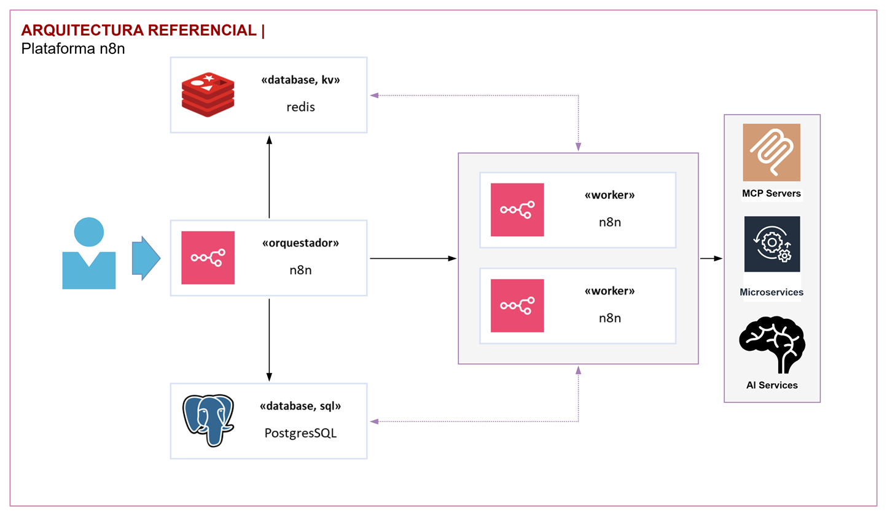

[[_TOC_]]

# Documentación de Arquitectura Referencial: Plataforma n8n

Este documento describe la arquitectura de referencia para el despliegue de la plataforma de automatización de flujos de trabajo n8n, diseñada para garantizar alta disponibilidad, seguridad y escalabilidad.

---

## Modelo Lógico

El siguiente diagrama ilustra la arquitectura de componentes para la plataforma n8n.

La arquitectura se basa en un modelo distribuido que separa el núcleo de orquestación de la ejecución de las tareas, permitiendo un escalado independiente de los componentes.

### Componentes de la Arquitectura

* **Orquestador n8n (Main Process):** 🧠
    * Es el **cerebro** de la plataforma. Este componente sirve la interfaz de usuario (UI) de n8n, gestiona los flujos de trabajo (workflows), las credenciales y las ejecuciones pasadas.
    * Es el punto de entrada para los usuarios y las llamadas a webhooks.
    * Se encarga de **planificar y encolar** las ejecuciones de los flujos de trabajo, pero no las ejecuta directamente en este modo.

* **Workers n8n (Worker Processes):** ⚙️
    * Son los encargados de **ejecutar los nodos** individuales de un flujo de trabajo.
    * Estos procesos toman las tareas de una cola gestionada en Redis, las ejecutan y devuelven el resultado.
    * La arquitectura permite tener múltiples workers, lo que habilita el **procesamiento en paralelo** y la **alta disponibilidad**. Si un worker falla, otro puede tomar la tarea.

* **PostgreSQL (Base de Datos SQL):** 🗄️
    * Actúa como la base de datos principal y persistente de la plataforma.
    * Almacena toda la información crítica, como la **definición de los workflows**, las **credenciales encriptadas**, el historial de ejecuciones y los datos de los usuarios.

* **Redis (Base de Datos Key-Value):** ⚡
    * Funciona como un **gestor de colas y caché** de alta velocidad.
    * Es fundamental para la comunicación y coordinación entre el Orquestador y los Workers. Almacena el estado de las ejecuciones en tiempo real y gestiona la cola de tareas pendientes.

* **Servicios Externos:** ↔️
    * Representan los sistemas con los que n8n interactúa. Esto puede incluir servidores propios (**MCP Servers**), **Microservicios** de la organización, o servicios de terceros como plataformas de **Inteligencia Artificial (AI Services)**, APIs, bases de datos, etc.

---

## Lineamientos Arquitecturales

La arquitectura propuesta se sustenta en los siguientes lineamientos para cumplir con los requerimientos de negocio y operativos.

### Alta Disponibilidad (HA)

La continuidad del servicio se garantiza mediante la eliminación de puntos únicos de fallo (SPOF):

1.  **Redundancia de Workers:** Se desplegarán múltiples réplicas de los workers. Si una instancia falla, las demás continuarán procesando las tareas de la cola sin interrupción del servicio. El escalado se puede gestionar dinámicamente según la carga.
2.  **Redundancia del Orquestador:** Se pueden ejecutar múltiples instancias del Orquestador detrás de un balanceador de carga para distribuir el tráfico y garantizar la disponibilidad de la UI y la API, incluso si una instancia cae.
3.  **Base de Datos Clusterizada:** Tanto **PostgreSQL** como **Redis** deben ser desplegados en una configuración de alta disponibilidad.
    * **PostgreSQL:** Se recomienda una configuración de clúster con al menos un nodo primario (lectura/escritura) y uno o más nodos de réplica (standby) con failover automático.
    * **Redis:** Se debe implementar usando **Redis Sentinel** para un escenario de alta disponibilidad con failover o **Redis Cluster** para un entorno distribuido que también ofrece escalabilidad horizontal.

### Seguridad 🛡️

La seguridad es un pilar fundamental. El diseño se alinea con los controles y objetivos de la norma **ISO/IEC 27001** y su guía de implementación **ISO/IEC 27002**.

1.  **Control de Acceso (A.9):**
    * **Gestión de Credenciales:** Las credenciales de los servicios externos se almacenan **cifradas** en la base de datos PostgreSQL. Se debe utilizar la variable de entorno `N8N_ENCRYPTION_KEY` con una clave robusta y gestionada de forma segura (ej. a través de un gestor de secretos).
    * **Mínimo Privilegio:** Las conexiones entre componentes (ej. n8n -> PostgreSQL) deben usar usuarios de base de datos con los permisos estrictamente necesarios.
    * **Políticas de Red:** Se deben implementar reglas de red (Network Policies en Kubernetes) para restringir la comunicación únicamente a los flujos necesarios (ej. solo los workers pueden comunicarse con los servicios externos, el orquestador no).

2.  **Criptografía (A.10):**
    * **Cifrado en Tránsito:** Toda la comunicación entre los componentes de la arquitectura y hacia los servicios externos debe estar cifrada mediante **TLS 1.2 o superior**. Esto incluye la conexión a la UI de n8n, la comunicación entre Orquestador-Workers y las conexiones a las bases de datos.
    * **Cifrado en Reposo:** Los datos sensibles en la base de datos PostgreSQL deben estar cifrados a nivel de disco/volumen. Las credenciales, como se mencionó, se cifran a nivel de aplicación por n8n.

3.  **Seguridad de las Operaciones (A.12):**
    * **Monitoreo y Logging:** Se debe centralizar y monitorear los logs de todos los componentes para detectar actividades anómalas.
    * **Gestión de Vulnerabilidades:** Se debe mantener un proceso de escaneo y parcheo regular de las imágenes de contenedor y todas las dependencias para mitigar vulnerabilidades conocidas. Utilizar siempre imágenes oficiales y actualizadas.

---

## Consideraciones de Despliegue

Para el despliegue sobre un clúster de **Kubernetes**, se recomienda el uso de **Cartas Helm** para estandarizar y simplificar la gestión del ciclo de vida de la aplicación.

### Despliegue con Helm 🚀

Se puede utilizar una carta Helm existente de la comunidad (ej. la disponible en el repositorio oficial de n8n) o crear una propia.

* **Componentes n8n (Orquestador y Workers):**
    * **Deployments:** Desplegar el **Orquestador** y los **Workers** como `Deployments` de Kubernetes separados. Esto permite escalarlos y actualizarlos de forma independiente.
    * **Horizontal Pod Autoscaler (HPA):** Configurar un HPA para los **Workers** basado en métricas de consumo de CPU/Memoria o, idealmente, en métricas personalizadas como el tamaño de la cola de Redis (`LLEN queue_name`).
    * **Probes:** Implementar `livenessProbe` y `readinessProbe` para todos los pods de n8n para que Kubernetes pueda gestionar su estado de salud de forma automática.
    * **Configuración:** Utilizar `ConfigMaps` para la configuración general y `Secrets` para toda la información sensible (clave de cifrado, credenciales de la base de datos, etc.).

* **Bases de Datos (PostgreSQL y Redis):**
    * **Opción Recomendada (Servicio Gestionado):** La mejor práctica es utilizar servicios de base de datos gestionados por el proveedor de la nube (ej. AWS RDS, Google Cloud SQL, Azure Database for PostgreSQL; ElastiCache para Redis). Esto delega la complejidad de la alta disponibilidad, backups y mantenimiento.
    * **Opción Auto-Alojada:** Si se requiere un despliegue dentro del clúster:
        * Utilizar **operadores de Kubernetes** (ej. `Crunchy Data` para PostgreSQL, `Redis Enterprise Operator` para Redis) que gestionan `StatefulSets`, almacenamiento persistente (`PVCs`), backups y configuraciones de clúster de forma robusta.
        * Si no se usan operadores, desplegarlos mediante cartas Helm que soporten configuraciones de alta disponibilidad, gestionando `StatefulSets` para garantizar la persistencia y la identidad de red estable.

* **Consideraciones Generales de Kubernetes:**
    * **Ingress:** Exponer el servicio del **Orquestador n8n** a través de un objeto `Ingress` para gestionar el acceso externo, la terminación TLS y el enrutamiento.
    * **Network Policies:** Aplicar políticas de red estrictas para aislar los componentes. Por ejemplo, el Orquestador solo debería poder hablar con Redis y PostgreSQL. Los Workers deberían poder hablar con Redis, PostgreSQL y los servicios externos necesarios. El acceso público solo debería permitirse al Ingress.
    * **Resource Quotas:** Definir `requests` y `limits` de CPU y memoria para todos los pods para asegurar un uso predecible de los recursos del clúster y evitar que un componente afecte a los demás.