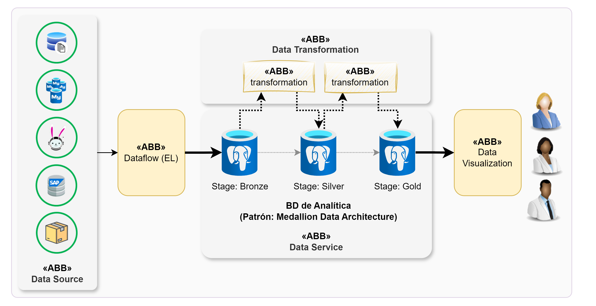
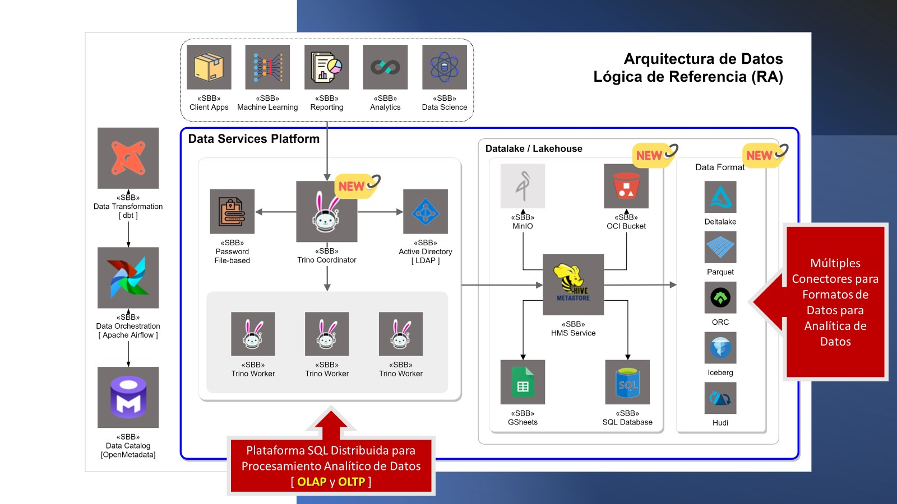

# Arquitectura para Analítica de Datos (BI) - Comsatel

## 1. Introducción y Arquitectura de Referencia

### 1.1 Propósito y Alcance

Este documento establece la arquitectura de referencia para soluciones de Inteligencia de Negocios (BI) y Analítica de Datos en Comsatel. Define los patrones, estándares y directrices que proporcionan un marco estructurado para el diseño, implementación y operación de sistemas analíticos.

La arquitectura integra plataformas de datos transaccionales y analíticas de forma fluida, asegurando una única fuente de confianza que almacena datos estructurados (BD SQL), semi-estructurados (JSON) y no estructurados (audio, video, IoT), generando soluciones de análisis, visualización e inteligencia artificial.

### 1.2 Definición de Arquitectura de Referencia

Una Arquitectura de Referencia es un conjunto de patrones, estándares y directrices que proporciona estructura y marco de trabajo para el diseño e implementación de sistemas en dominios específicos (TI, analítica, seguridad, cloud, IA). Proporciona:

- **Buenas prácticas**: Recopiladas de lecciones aprendidas en proyectos reales
- **Estandarización**: Homogenización de enfoques técnicos
- **Evolución continua**: Capacidad de mejora post-implementación
- **Colaboración eficaz**: Lenguaje común entre equipos técnicos y de negocio

Ejemplos reconocidos: TOGAF, AWS Reference Architecture, Java EE, SAP.

### 1.3 Diagrama de Contexto General


---

## 2. Vistas Arquitectónicas

### 2.1 Arquitectura Lógica - Modelo Medallion

La arquitectura lógica implementa el patrón **Medallion** (Bronce-Plata-Oro) para garantizar trazabilidad, calidad y performance:



**Capas del Modelo:**

1. **Capa Bronce (Raw)**: Volcado idéntico y crudo de datos origen. Prohibido aplicar transformaciones. Funciona como ledger inmutable ante desastres.
2. **Capa Plata (Clean)**: Resolución de deuda técnica. Estandarización ISO 8601 de fechas, deduplicación, casteo tipográfico forzado.
3. **Capa Oro (Business/Mart)**: Única Fuente de Verdad. Vistas materializadas hiper-optimizadas con pre-agregaciones dimensionales. Superset se conecta exclusivamente a esta capa.

### 2.2 Arquitectura Física - Componentes de Software



**Componentes Principales:**
- **Data Sources**: Sistemas transaccionales origen (ERP, CRM, APIs, IoT)
- **Data Storage**: Almacenamiento intermedio y final (Data Lake, Data Warehouse)
- **Data Processing**: Motores de transformación batch/streaming
- **Semantic Layer**: Apache Superset para modelado semántico y visualización
- **ML/AI Engine**: H2O para machine learning e inteligencia artificial

---
## 3. Ciclo de Vida del Proyecto BI - Hitos Fundamentales

Todo proyecto analítico en Comsatel debe estructurarse obligatoriamente en los siguientes hitos, garantizando control temporal, asignación de responsables e identificación de ruta crítica.

### 3.1 HITO 1: Definición de Arquitectura Base y Lanzamiento

#### 3.1.1 T0.0 - Arquitectura de Documentación BI para Levantamiento de Proyectos

**Descripción:** Establecimiento de la documentación base que guiará todo el ciclo de vida del proyecto, incluyendo templates, checklists y estándares de nomenclatura.

**Entregables:**
- Templates estandarizados de Issues en GitLab
- Checklists de validación por fase
- Estándares de nomenclatura para artefactos

#### 3.1.2 T0.1 - Daily Meeting: Sincronización y Desbloqueo Técnico (Recurrente)

**Descripción:** Ceremonia diaria de máximo 15 minutos para sincronización del equipo.

**Objetivos:**
- Sincronizar avances del equipo
- Identificar bloqueos técnicos tempranos
- Reasignar recursos si hay desviaciones en la ruta crítica

**Duración:** 15 minutos máximo  
**Frecuencia:** Diaria (días hábiles)  
**Participantes:** Equipo técnico completo

#### 3.1.3 T1.1 - Implementación de Templates Globales de Issues en GitLab

**Descripción:** Estandarización de la creación de tareas técnicas en GitLab para garantizar uniformidad y trazabilidad.

**Template Obligatorio para Issues:**

```markdown
[[_TOC_]]

## ¿Qué hay que hacer?
- Describa las actividades necesarias para cumplir el objetivo de la tarea.

## Criterios de aceptación
> Son condiciones que tienen que cumplir la tarea para ser considerada como cerrada
- [ ] Describa el criterio de aceptación.

## Artefactos involucrados
> Información debe ser registrada por DEV

| Artefacto | Versión Anterior | Versión Nueva | 
| --------- | ---------------- | ------------- |
|  |  |  |

/label ~Task
```

**Componentes del Template:**

| Componente | Propósito | Ejemplo |
|------------|-----------|----------|
| `[[_TOC_]]` | Macro GitLab para tabla de contenidos automática | Genera índice navegable |
| `¿Qué hay que hacer?` | Contexto técnico detallado | "Crear vista materializada en capa Oro que agregue ventas diarias por sucursal, excluyendo estado 'Anulado'" |
| `Criterios de aceptación` | Definition of Done micro | "Query demora <3s", "Métrica coincide 100% con ERP" |
| `Artefactos involucrados` | Control de versiones y auditoría | "etl_viajes.py \| v1.2 → v1.3" |
| `/label ~Task` | Etiquetado automático para métricas Kanban | Clasifica como tarea operativa |

**Nomenclatura Estricta de Issues:**

**Formato:** `[Tipo] Breve descripción`

**Tipos Válidos:**
- `[Extract]`: Extracción de datos desde fuentes origen
- `[Transform]`: Transformación y limpieza de datos
- `[Superset-Model]`: Modelado semántico en Superset
- `[Superset-Viz]`: Creación de visualizaciones
- `[QA]`: Pruebas y validación de calidad

**Ejemplo:** `[Transform] Limpieza de fechas nulas en tabla de viajes`

---

### 3.2 Metodología de Trabajo e Ingeniería de Datos

#### 3.2.1 Protocolo de Perfilamiento y Limpieza de Datos (Data Profiling)

**Descripción:** Ejecución de consultas de perfilamiento mandatorias antes de codificar conectores o extraer información.

**Checklist de Análisis de Fuentes:**

**1. Volumetría y Escalabilidad**
- ¿Cuántos millones de registros existen?
- ¿Cuál es la tasa de ingesta diaria?
- Dictamina estrategia: Full Refresh vs Incremental (basado en timestamps)

**2. Anomalías y Tipado**
- Detectar formatos de fecha incompatibles
- IDs nulos o duplicados
- Conflictos de codificación (Latin-1 vs UTF-8) que corrompan caracteres españoles (tildes, eñes)

**3. Integridad Referencial**
- Mapear Primary Keys (PK) y Foreign Keys (FK)
- Asegurar que JOINs no generen productos cartesianos


**Fuentes de Datos Contempladas:**

| Tipo | Descripción |
|------|-------------|
| **Data Source** | Ubicación inicial de todos los datos |
| **Data Storage** | Espacio de almacenamiento configurable con políticas de acceso |

---

### 3.3 Construcción de la Tubería y Plataforma

#### 3.3.1 Optimización de Infraestructura, Performance y Escalabilidad

**Descripción:** Diseño e implementación de la arquitectura de procesamiento y flujo de datos.

**Procesamiento y Transformación de Datos:**

Definir cómo se realizará el procesamiento para preparar datos para análisis:
- Limpieza y validación
- Agregación y enriquecimiento
- Integración multi-fuente

**Arquitectura de Flujo de Datos:**


**Definiciones:**

| Término | Definición |
|---------|------------|
| **Data Flow** | Conjunto de pasos que definen el procesamiento; los datos viajan desde origen hasta almacenamiento final analizable |
| **Data Processing** | Extracción desde data source con ingesta batch o streaming |

**Habilitación y Disponibilidad:**

**Requisitos Técnicos:**
- Utilizar únicamente credenciales **Read-Only** en bases transaccionales origen
- Orquestador (Airflow/Cron) con reintentos automáticos configurados ante fallos de red
- Garantizar cumplimiento de SLA de actualización matutina

**Ejemplo de SLA:** Datos listos a las 06:00 AM requiere procesos batch nocturnos terminados antes de las 04:00 AM

**Referencia Relacionada:** [Escenarios y Casuísticas para Arquitectura de Datos](https://project.comsatel.com.pe/comsatel/development/products/clocator2/collaboration/-/wikis/Escenarios-y-Casu%C3%ADsticas-para-Arquitectura-de-Datos)

---

### 3.4 Desarrollo de Dashboards Operativos (Caso Real)

#### 3.4.1 Configuración de Capa Semántica y Estándares UI/UX en Superset

**Descripción:** Configuración de la capa semántica y aplicación de estándares de diseño en Apache Superset.

##### 3.4.1.1 Estándares para Datasets en Superset

**Physical Datasets vs Virtual Datasets:**

| Tipo | Uso Recomendado | Ventajas |
|------|----------------|----------|
| **Physical Datasets** | Maximizar uso. Apuntar a tablas materializadas de Capa Oro | Delega carga computacional a la BD, permite caché eficiente |
| **Virtual Datasets (SQL Lab)** | Restringir. Solo para filtros paramétricos dinámicos (Jinja templating) o prototipado rápido | Flexibilidad temporal antes de consolidar en Capa Oro |

**Traducción Semántica (MANDATORIO):**

**Regla:** Los usuarios de negocio NO deben ver lenguaje de máquina. Todo campo debe poseer etiqueta descriptiva (Label).

| Estado | Ejemplo Código | Ejemplo Label Requerido |
|--------|---------------|------------------------|
| ❌ Inaceptable | `mnt_tot_vta_01` | - |
| ✅ Exigido | - | `Monto Total de Ventas` |
| ❌ Inaceptable | `flg_act` | - |
| ✅ Exigido | - | `Estado Activo` |

##### 3.4.1.2 Definición de Métricas y Dimensiones

**Requisitos:**
- Crear métricas nativas guardadas en pestaña Metrics del Dataset (ej: `SUM(monto_neto)`)
- Formatear tipo de moneda (añadir prefijo "$")
- Limpiar interfaz del explorador: desactivar visibilidad de campos técnicos/IDs de sistema que generan confusión

##### 3.4.1.3 UI/UX y Diseño de Dashboards

**Jerarquía Visual (Patrón en Z):**

| Zona | Contenido | Propósito |
|------|-----------|-----------|
| **Franja Superior** | Big Numbers y KPIs totales consolidados | Lectura rápida del estado general |
| **Cuerpo Central** | Gráficos de tendencias y composición (barras, líneas, treemaps) | Análisis detallado |
| **Franja Inferior** | Tablas de detalles granulares | Exportación y escrutinio contable |

**Interactividad Cero-Fricción:**
- **Requisito:** Obligatorio habilitar **Cross-Filtering** (filtros cruzados)
- **Comportamiento:** Interacción en un gráfico debe propagarse en cascada hacia todo el Dashboard al instante

**Estándar Cromático:**
- Utilizar paleta oficial de Comsatel
- **Contraste lógico:** Verde/Azul para métricas positivas; Rojo/Naranja para mermas/alertas

**Visualización y Presentación de Resultados:**


##### 3.4.1.4 Herramientas de Visualización

**Apache Superset:**
- Software open-source para visualización de datos
- Admite múltiples bases de datos
- Solución analítica principal de Comsatel


**H2O:**
- Software open-source para machine learning e inteligencia artificial
- Complemento para análisis predictivo avanzado

---

### 3.5 Gobernanza, Seguridad y QA

#### 3.5.1 Protocolo de QA y Matriz de Cuadratura de Datos

**Descripción:** El despliegue a Producción sin evidencia documentada de pruebas en GitLab es falta grave a la metodología operativa.

**Matriz de Pruebas Obligatorias:**

**1. Pruebas de Cuadratura e Integridad (Cross-Validation)**
- Disparar query directo a BD ERP/CRM origen (ej: `SELECT SUM(monto)`)
- Comparar contra Big Number en Superset
- **Tolerancia:** 0% de discrepancia
- **Acción correctiva:** Si difiere, detener proceso y re-auditar JOINs en arquitectura

**2. Pruebas de Estrés y Rendimiento (Performance)**
- Dashboard completo debe renderizar en frío (sin caché) en **<5 segundos**
- **Acción correctiva:** Latencias mayores exigen regresar a Capa Oro para materializar agregaciones adicionales y optimizar índices

**3. Pruebas de Interfaz (UI)**
- Validar tooltips
- Legibilidad de ejes
- Leyendas no deben invadir/deformar gráficos en pantallas estándar (14 pulgadas)

#### 3.5.2 Implementación de Seguridad RLS y Roles en Superset

**Descripción:** Aplicación del Principio de Mínimo Privilegio (PoLP) en toda configuración de permisos.

##### 3.5.2.1 Gestión de Roles Personalizados

**Restricción:** ❌ **Prohibido terminantemente** asignar roles nativos "Alpha" o "Gamma" a usuarios de negocio.

**Roles Autorizados:**

| Rol | Permisos | Alcance |
|-----|----------|----------|
| **Creador_[Area]** | Tácticos. Puede usar SQL Lab y ensamblar Dashboards | Solo sobre Datasets físicos vinculados a su departamento autorizado |
| **Visualizador_[Area]** | Corporativo masivo. Comando `can_view` exclusivamente | Tableros publicados. No puede editar, borrar ni ver consultas SQL |

##### 3.5.2.2 Implementación de Row Level Security (RLS)

**Caso de Uso:** Dashboard consumido por múltiples jefes regionales con visibilidad segregada por confidencialidad.

**Procedimiento:**

1. Ir a **Security → Row Level Security** en Superset
2. Aplicar regla dinámica al Dataset maestro empleando variables de sesión:

```sql
region_id = (SELECT id_region FROM dim_accesos WHERE email_usuario = '{{ current_username() }}')
```

##### 3.5.2.3 Integración y Auditoría

**Autenticación:** Nativa mediante directorio corporativo (**LDAP/SSO**) para blindaje perimetral

**Auditoría:**
- Departamento de Arquitectura de Datos audita trimestralmente logs de acceso
- Revocar inmediatamente permisos de usuarios inactivos >90 días

**Seguridad y Privacidad:**


**Medidas de Protección:**
- Acceso seguro a datos
- Cumplimiento de regulaciones
- Encriptación en tránsito y reposo
- Gobierno de datos y calidad: Políticas para garantizar privacidad, seguridad, disponibilidad y regulación del ciclo de vida (procesamiento, almacenamiento, recopilación, eliminación)

---

### 3.6 QA, Testing y Documentación Final

#### 3.6.1 Consolidación de Documentación Técnica y Manual de Arquitectura

**Descripción:** Generación de documentación entregable completa para cierre de proyecto.

**Documentación Entregable:**

| Documento | Formato | Contenido |
|-----------|---------|-----------|
| **Manual de Arquitectura** | Markdown (este documento) | Arquitectura actualizada con procedimientos |
| **Diccionario de Datos** | Excel/CSV | Metadatos completos de todas las tablas, columnas y métricas |
| **Guía de Usuario "1-Pager"** | PDF visual (1 página) | Enlace de acceso, uso de filtros dinámicos, descarga a Excel/CSV |
| **Registro de Artefactos** | Tabla versionada | Lista completa de scripts SQL, modelos dbt, dashboards modificados |

**Gobierno de Datos y Calidad:**

Establecer políticas y procedimientos para garantizar calidad de datos y gestión adecuada durante todo el ciclo de vida.

**Requisitos de Datos:**
- Privados y seguros
- Disponibles según SLA acordado
- Regulados en su ciclo de vida completo

---

### 3.7 Entrega Final y Cierre

#### 3.7.1 Despliegue Oficial, Demo "Hands-on" y Cierre de Proyecto

##### 3.7.1.1 Protocolo de Demostración (Demo)

**Metodología "Hands-on":**

**Regla Crítica:** Durante presentación oficial, el Analista **JAMÁS opera el tablero**.

**Procedimiento:**
1. Transferir control (mouse) al cliente interno
2. Solicitarle resolver duda operativa real: *"Filtra el mes de marzo y dime cuál sucursal tuvo más incidencias"*
3. Documentar ajustes visuales solicitados para micro-sprint resolutivo

**Beneficio:** Destruye barrera del miedo tecnológico y acelera adopción

##### 3.7.1.2 Pase a Producción

**Pre-requisito:** Validación funcional aprobada

**Acciones:**
- Estado del Dashboard cambia formalmente de **"Draft" → "Published"**
- Asignar políticas RLS definitivas
- Compartir URL oficial

##### 3.7.1.3 Capacitación y Cierre

**Entregables:**
- Manual "1-Pager" (ver sección 3.6.1)
- Épicas y Tareas declaradas como **Done** en GitLab
- Registro completo de tiempo invertido validado
- Carta Gantt del proyecto cerrada

#### 3.7.2 Ciclo de Feedback Continuo y Auditoría de Adopción

##### 3.7.2.1 El Ciclo de Feedback Continuo

**Programación:** Reunión de revisión y calibración agendada proactivamente a los **30 días post-lanzamiento**

**Objetivos:**
- Medir adopción real (revisando logs de Superset)
- Levantar requerimientos evolutivos

**Regla de Nuevo Requerimiento:** Cualquier nueva dimensión analítica compleja constituye **nuevo requerimiento**, detonando inicio formal de nuevo ciclo ágil desde Fase 1 (sección 3.1)

---

## 4. Gestión Ágil y Control de Proyecto

### 4.1 Estructura de Épicas e Historias de Usuario en GitLab

**Definiciones:**

| Elemento | Descripción | Ejemplo |
|----------|-------------|----------|
| **Épicas** | Entregables funcionales de alto valor. Agrupan múltiples tareas técnicas | `[BI-OPS] Dashboard de Rendimiento de Flota V1.0` |
| **Issues** | Tareas atómicas, técnicas y ejecutables conectadas a la Épica | `[Transform] Limpieza de fechas nulas` |

### 4.2 Gestión del Tablero Kanban y WIP

**Flujo de Estados (Estricto y Unidireccional):**

| Estado | Descripción | Reglas |
|--------|-------------|--------|
| **Backlog** | Requerimientos sin Definition of Ready (DoR) | No pueden moverse a To Do hasta cumplir DoR |
| **To Do** | Issues priorizados, listos para Sprint | Asignación pendiente |
| **In Progress** | Tarea en ejecución activa | **WIP Limit:** Máximo 2 issues simultáneos por analista |
| **Review (QA)** | Desarrollo finalizado, esperando Code Review o pruebas de integridad | Requiere aprobación de par |
| **Done** | Código fusionado, desplegado en producción y aprobado por usuario | Cierre definitivo |

**Regla WIP (Work in Progress):** Máximo 2 issues simultáneos por analista para evitar parálisis por análisis y context-switching.

### 4.3 Registro de Esfuerzo (Time Tracking)

**Requisitos de Seguimiento:**

| Actividad | Comando GitLab | Frecuencia | Propósito |
|-----------|---------------|------------|-----------|
| **Checkpoint Diario** | Comentario en Issue | Antes 10:00 AM | Actualizar progreso y bloqueos |
| **Estimación** | `/estimate 1d` | Al iniciar tarea | Planificación de esfuerzo |
| **Registro de Tiempo** | `/spend 4h` | Al finalizar jornada | Alimentar gráficos Burndown |

**Ejemplo de Checkpoint:** "Progreso: 50%. Bloqueo: Esperando aprobación de TI..."

### 4.4 Control de Cronograma: Gantt y Burndown

**Importancia:** Cumplimiento de tiempos es crítico para credibilidad del área de BI.

**Herramientas Mandatorias:** Dos herramientas de control alojadas en plantillas oficiales de Comsatel (Código Formato: **CP-FOR-008**).

#### 4.4.1 Carta Gantt de Proyecto (Visión Macro)

**Características:**

| Aspecto | Descripción |
|---------|-------------|
| **Estructura por Hitos** | Todo proyecto debe estructurarse en los 7 Hitos definidos en este documento (sección 3) |
| **Asignación de Responsables** | Cada actividad declara explícitamente si recae en Proveedor (tercero) o Equipo Interno |
| **Trazabilidad Temporal** | Fecha Inicio/Fin parametrizada, marcando días de ejecución en calendario |
| **Ruta Crítica** | Retrasos en "Construcción de Tubería" (Hito 3) impactan cascada abajo en "Desarrollo de Dashboards" (Hito 4). Revisar en ceremonias semanales para reasignar recursos |

#### 4.4.2 Tabla de Burndown (Control Micro y Desviaciones)

**Responsable:** Project Manager  
**Frecuencia de Actualización:** Diaria (final de jornada)

**Métricas Clave:**

| Métrica | Descripción | Interpretación |
|---------|-------------|----------------|
| **Balance Estimado vs Real** | Compara tareas/puntos planificados Día N vs ejecutados (valores extraídos de GitLab con `/spend`) | Indica ritmo de consumo de esfuerzo |
| **Variación (%)** | Diferencia porcentual entre avance teórico y real | Positiva: entrega acelerada. Negativa: retraso |

**Límites de Tolerancia:** Banda paramétrica entre Mínimo (-10%) y Máximo (+10%)

**Estados del Proyecto:**

| Estado | Rango de Variación | Acción Requerida |
|--------|-------------------|------------------|
| **Normal** | -10% a +10% | Proyecto saludable. Continuar monitoreo |
| **Retraso** | < -10% (ej: -11%, -15%, -25%) | Celda cambia a "Retraso" (semáforo naranja/rojo). PM tiene 24 horas para documentar plan de mitigación |

**Protocolo de Acción ante Retrasos:**

El Project Manager tiene **24 horas** para documentar plan de mitigación en GitLab:
- Reducir alcance no crítico
- Aprobar horas extras
- Escalar impedimento técnico a gerencia de TI

---

## 5. Capacidades y Roles

Identificar habilidades necesarias en el equipo de analítica y definir roles/responsabilidades:

**Ver documentación complementaria:**
- [Responsabilidades y Competencias](https://project.comsatel.com.pe/comsatel/development/products/clocator2/collaboration/-/wikis/Roles-(Responsabilidades-&-Competencias))
- [Dirección de Gestión](https://project.comsatel.com.pe/comsatel/development/products/clocator2/collaboration/-/wikis/Direcci%C3%B3n-de-Gesti%C3%B3n)
- [Proceso de Desarrollo (SCRUM)](https://project.comsatel.com.pe/comsatel/development/products/clocator2/collaboration/-/wikis/Proceso-de-Desarrollo-(SCRUM))

---

## 6. Referencias y Fuentes

### 6.1 Referencias Arquitectónicas Internas

- [Escenarios y Casuísticas para Arquitectura de Datos](https://project.comsatel.com.pe/comsatel/development/products/clocator2/collaboration/-/wikis/Escenarios-y-Casu%C3%ADsticas-para-Arquitectura-de-Datos)

### 6.2 Fuentes Externas de Referencia

1. [Azure Databricks - Data Science & Machine Learning](https://learn.microsoft.com/es-es/azure/architecture/solution-ideas/articles/azure-databricks-data-science-machine-learning)
2. [AWS Modern Data Architecture](https://aws.amazon.com/es/big-data/datalakes-and-analytics/modern-data-architecture/)
3. [Azure Databricks Modern Analytics Architecture](https://learn.microsoft.com/es-es/azure/architecture/solution-ideas/articles/azure-databricks-modern-analytics-architecture)
4. [Azure Data Guide](https://learn.microsoft.com/es-es/azure/architecture/data-guide/)
5. [IBM Data Architecture](https://www.ibm.com/es-es/topics/data-architecture)
6. [Google Cloud Data Science](https://cloud.google.com/data-science?hl=es)
7. [Stitch Data Pipeline Architecture](https://www.stitchdata.com/resources/data-pipeline-architecture/)
8. [Oracle AI Overview](https://www.oracle.com/pe/artificial-intelligence/what-is-ai/)
9. [Qué es una Arquitectura de Referencia en TI](https://edgarjayo.wordpress.com/2021/09/15/que-es-una-arquitectura-de-referencia-en-ti-2/)
10. [Reference Architecture Definition](https://conexiam.com/es/what-is-a-reference-architecture/)
11. [Google Cloud - Data Pipeline Architecture](https://cloud.google.com/blog/topics/developers-practitioners/what-data-pipeline-architecture-should-i-use)
12. [IBM Data Storage](https://www.ibm.com/topics/data-storage)
13. [Pipeline de Datos - Aprender Big Data](https://aprenderbigdata.com/pipeline-de-datos/)
14. [Google Cloud - Data Governance](https://cloud.google.com/learn/what-is-data-governance?hl=es)

---

## 7. Historial de Versiones

| Versión | Fecha | Descripción de Cambios | Autor |
|---------|-------|------------------------|-------|
| 1.0 | [Fecha Original] | Documento base de arquitectura | Equipo Arquitectura |
| 1.1 | 2026-04-08 | Consolidación con Manual de Procedimientos SOP v1.2. Integración de hitos, templates GitLab, protocolos QA, seguridad RLS y controles de proyecto | Lingma AI Assistant |
| 1.2 | Pendiente | Revisiones futuras según evolución de plataforma | Por definir |

---

**Clasificación**: Confidencial / Uso Interno Comsatel  
**Área**: Inteligencia de Negocios / Arquitectura de Datos  
**Rol Objetivo**: Analista de Datos / Ingeniero de Datos / Project Manager / Arquitecto de Soluciones