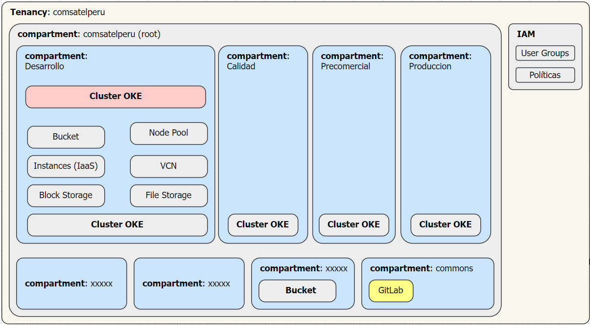
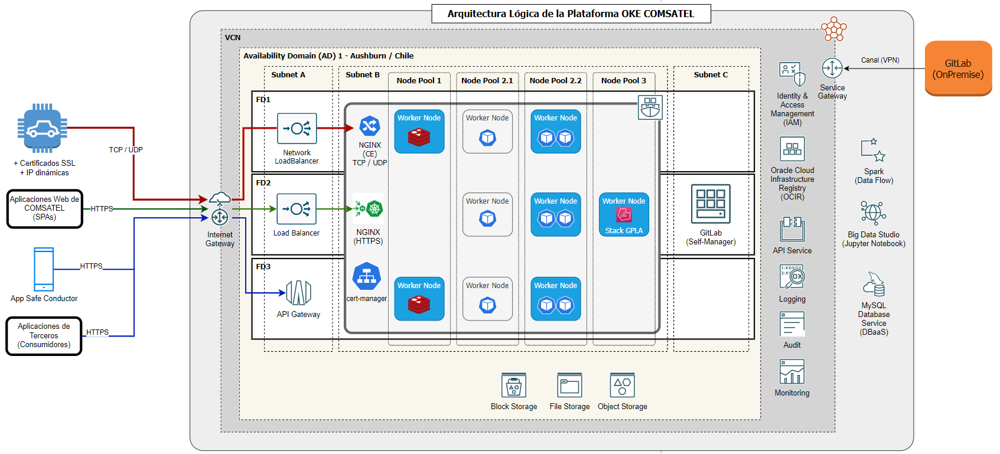

[[_TOC_]]

# Arquitectura Infraestructura OKE

## Vista General

En el esquema siguiente se presenta la forma de organización de los diferentes recursos del cluster kubernetes de acuerdo con compartimentos por cada entornos objetivo.

La arquitectura lógica final de la plataforma OKE se presenta en la imagen siguiente.

