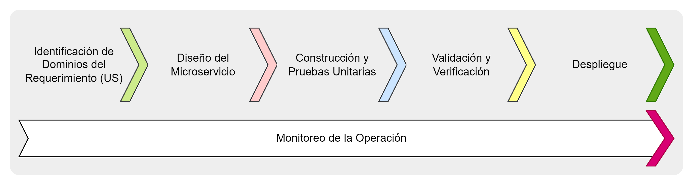
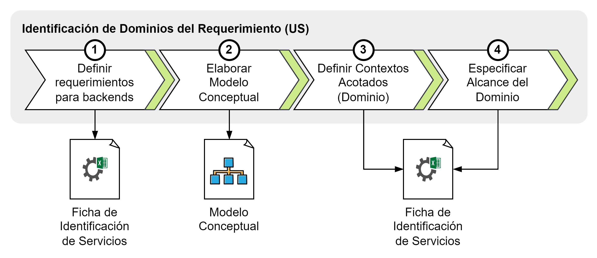
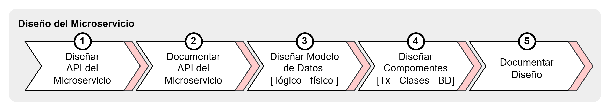
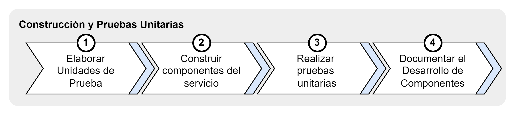
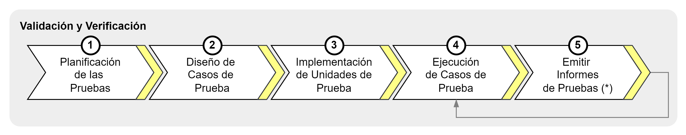

[[_TOC_]]

# Ciclo de Vida de los Microservicios

## Introducción

La Arquitectura Referencial para las plataformas desarrolladas por COMSATEL se basan en el estilo arquitectural basada en microservicios, entendiéndose por microservicio a _... un enfoque arquitectura para construir aplicaciones donde cada función `core`, o `servicio`, es `construido` y `desplegado` de forma `independiente`_.

El ciclo de vida de los microservicios cubre todas las actividades necesarias para desarrollar microservicios conformes con la [Arquitectura de Referencia de los microservicios](arquitectura/definición-arquitectura-microservicio)

## Actividades

### Identificación de Dominios

#### Definir requerimientos para backends
Se debe tomar en cuenta las siguientes consideraciones durante el desarrollo de esta actividad:

1. Se debe definir las funcionalidades requeridas para el backends.
2. Se debe definir los requerimientos no funcionales relacionados a cada funcionalidad identificada.
3. Se debe completar la especificación de las funcionalidades a través de la [Plantilla de Identificación de Microservicios](workproducts/ficha-identificacion-microservicios.md)

#### Elaborar Modelo Conceptual
Se debe tomar en cuenta las siguientes consideraciones durante el desarrollo de esta actividad:

1. Se debe identificar todos los objetos de negocio (nota: considerar sustantivos y las especializaciones de estos que se introducen con los adjetivos) enmarcados en las especificaciones de las historias de usuario y de los mockups (UX/UI). Por ejemplo, Dispositivo, Solicitud de Instalación, Viaje Cerrada, entre otros.
2. Se debe identificar todos los eventos de negocio (sucesos relevantes que se producen durante la ejecución de las actividades del negocio) sobre los que se debe mantener información. Por ejemplo, Vencimiento del Contrato, Anulación de Cita, entre otros.
3. Se debe clasificar cada objeto de negocio según los patrones de Domain-Driven Design siguientes: Entity (objetos cuya información en sensible de variar en el tiempo) o Value Object (objetos inmutables en el tiempo)
4. Se debe elaborar un Modelo de los Conceptos y sus relaciones (`recomendamos utilizar un Diagrama de Robustez de UML`)
5. Se debe alimentar el glosario de términos propios del dominio [DDD - Ubiquitous Language](https://martinfowler.com/bliki/UbiquitousLanguage.html)

#### Definir Contextos Acotados (Dominios)
Se debe tomar en cuenta las siguientes consideraciones durante el desarrollo de esta actividad:

1. Se debe identificar los objetos de negocio principales (`ciudadanos de primer nivel`) que definen agregados en el Modelo Conceptual. Estos constituyen en Domain-Driven Design (DDD) los `Aggregates` o `Root Entities`.
2. Se debe asociar cada aggregates/root entity con las funcionalidades identificadas.
3. Se debe agrupar todos los objetos directamente relacionados a cada `aggregate` / `root entity` asegurando que estos agrupamentos incluyan objetos altamente cohesionados (nota: enfocarse de forma primaria en los objetos del Modelo Conceptual entre los que se tracen asociados UML de tipo Aggregación y Composición).
4. Se debe asignar un nombre a cada agrupamiento generado, tomando como base inicial el `aggregate` principal del agrupamiento siendo este el [Dominio o Contexto Acotado](https://martinfowler.com/bliki/BoundedContext.html).

#### Especificar Alcance del Dominio
Se debe tomar en cuenta las siguientes consideraciones durante el desarrollo de esta actividad:

1. Se debe asignar los objetos de negocio de tipos `aggregate` o `root entity` las funcionalidades definidas.
2. Se debe agrupar las funcionalidades definiendo historias de usuario.
3. Se debe completar el glosario de términos propios del dominio [DDD - Ubiquitous Language](https://martinfowler.com/bliki/UbiquitousLanguage.html)

### Diseño del Microservicio

#### Diseño de Arquitectura
Se debe tomar en cuenta las siguientes consideraciones durante el desarrollo de esta actividad:

1. Se debe aplicar los diferentes patrones de diseño establecidos en [Domain Driven Design](https://martinfowler.com/bliki/DomainDrivenDesign.html). A modo de resumen incluye de los patrones tácticos: Raíz (de agregación), [Agregado](https://martinfowler.com/bliki/DDD_Aggregate.html), Entidad, Objeto de Valor (VO), Servicio de Dominio, Evento de Dominio, Repositorio, Objeto de Transferencia (DTO) 
2. Se debe aplicar los diferentes patrones de diseño establecidos en [Arquitectura Hexagonal](https://alistair.cockburn.us/hexagonal-architecture/). A modo de resumen, los patrones principales aplicables a nuestra arquitectura incluyen: Puertos (exponen la funcionalidad en término de servicios ofrecidos a través de diferentes protocolos), Adaptadores (conectan al microservicio con servicios requeridos).
3. Se debe considerar las capas establecidas para la arquitectura (presentación, aplicación, dominio e infraestructura) definidas en nuestra arquitectura de referencia y las dependencias establecidas entre ellas. El reforzamiento de la arquitectura es implementado a través de [Framework de Archunit](https://www.archunit.org/) que se integra a las pruebas unitarias.
4. Se debe asegurar que variaciones a las API de los servicios incluyan concenso con terceros consumidores de las API para evitar un quiebre de las integraciones.
5. Se debe considerar a RESTFull como el estilo arquitectural base para los microservicios. La aplicación de un estilo arquitectural diferentes que exponga funcionalidades de microservicios deberá ser aprobado por COMSATEL.
6. Se debe considerar como frameworks base de la arquitectura a SpringBoot / SpringCloud. Otras alternativas deberán ser evaluadas y aprobadas por COMSATEL. Se debe revisar las versiones específicas de los [frameworks aprobados para la arquitectura de referencia](https://project.comsatel.com.pe/comsatel/development/metodologia/-/wikis/arquitectura/frameworks/frameworks)
7. Se debe utilizar el Arquetipo Maven conforme [Guia de Uso del Arquetipo Maven](guias/generacion-microservicio-con-arquetipo-maven-quarkus) para crear la estructura base del microservicio.

#### Diseño Detallado
Se debe tomar en cuenta las siguientes consideraciones durante el desarrollo de esta actividad:

1. Se debe elaborar un diseño de la secuencia de interecciones requeridas entre las diferentes clases principales de la solución. Se recomienda el empleo de UML a través de Diagramas de Secuencias y/o Diagramas de Colaboración.
2. Se debe elaborar un diseño de la secuencia de interacciones que inicien en clases incluidas en la capa de presentación, aplicación, dominio e infraestructura.
3. Se debe elaborar un diseño de lógico y físico detallado de los datos, sean estos orientados a una base de datos SQL, base de datos No-SQL u otro tipo requerido.
4. Se debe aplicar el [Estándar de Base de Datos](../estandares/base-datos) al definir los objetos y sus características.
5. Se debe documentar el diseño

### Construcción y Pruebas Unitarias

Se debe tomar en cuenta las siguientes consideraciones durante el desarrollo de esta actividad:

1. Se debe aplicar el [Estándard de Base de Datos](../estandares/base-datos) para todos los objetos y elementos para la Base de Datos MySQL.
2. Se debe construir sobre las [capas de la arquitectura](images/capas-arquitectura-microservicio.png) preservando la arquitectura definida.
3. Se debe construir usando la [Guía de Estilo Java](https://google.github.io/styleguide/javaguide.html) definida por Google.
4. Se debe incorporar las pruebas unitarias que aseguren las funcionalidades críticas empleando los [Frameworks de Pruebas unitarias](arquitectura/frameworks/frameworks)

### Pruebas del Microservicio

#### Pruebas Funcionales
Se debe tomar en cuenta las siguientes consideraciones durante el desarrollo de esta actividad:

1. Todas las unidades de pruebas automatizadas para los microservicios se deben incluir en un proyecto Postman ubicado en `test/functional/postman/Test.postman_collection` según se establece el [Arquetipo para microservicios](https://project.comsatel.com.pe/comsatel/development/common/archetypes/microservice-springboot-archetype/-/tree/develop/src/main/resources/archetype-resources/test/functional/postman).
2. Todos los casos de pruebas se deben diseñar de acuerdo con [Especificaciones del Caso de Prueba](workproducts/Casos-de-Prueba)
3. Todos los casos de pruebas automatizados se ejecutan de forma automática como parte del [Pipeline de CI/CD](gestion-configuracion/gestión-de-configuración)

#### Pruebas de Carga
Se debe tomar en cuenta las siguientes consideraciones durante el desarrollo de esta actividad:

1. Todas las unidades de pruebas de carga automatizadas para los microservicios se deben incluir en proyecto `Grafana k6` ubicado en `test/load/k6.js` según se establece el [Arquetipo para microservicios](https://project.comsatel.com.pe/comsatel/development/common/archetypes/microservice-springboot-archetype/-/tree/develop/src/main/resources/archetype-resources/test/load).
2. Todos los casos de pruebas se deben diseñar de acuerdo con [Especificaciones del Caso de Prueba](workproducts/Casos-de-Prueba)
3. Todos los casos de pruebas de carga automatizados se ejecutan de forma automática como parte del [Pipeline de CI/CD](gestion-configuracion/gestión-de-configuración)
4. Se debe tomar las precauciones sobre la demanda de recursos que se pueden requerir para la ejecución de las pruebas según las capacidades y/o limitaciones propias del entorno Kubernetes (QA) en Nube de Oracle.

#### Pruebas de Seguridad
Se debe tomar en cuenta las siguientes consideraciones durante el desarrollo de esta actividad:

1. Se debe cumplir con el [Perfil de Calidad](validacion-verificacion/perfil-calidad-sonarqube) establecido para Static Analysis Security Testing realizado con SonarQube y ejecutado por [Pipeline de CI/CD](gestion-configuracion/sast)
2. Se debe cumplir con el [Perfil de Calidad](gestion-configuracion/postman) establecido para las pruebas funcionales, que en resumen corresponden con la cobertura exitosa del 100% de los casos de pruebas automatizados y manual.
3. Se debe cumplir con el [Perfil de Calidad](validacion-verificacion/pruebas-carga-k6) establecido para las pruebas de carga, que en resumen corresponden con la cobertura exitosa del 100% de los casos de pruebas de carga y ejecutado por [Pipeline de CI/CD](gestion-configuracion/k6)
4. Se debe cumplir con el [Perfil de Calidad](gestion-configuracion/dast-zap) establecido para las pruebas de vulnerabilidad y ejecutado por [Pipeline de CI/CD](gestion-configuracion/dast-zap).

### Despliegues
Se debe tomar en cuenta las siguientes consideraciones durante el desarrollo de esta actividad:

1. Se debe considerar que los despliegues a los diferentes entornos se realiza con una [Tarea Automatizadas en el Pipeline de CI/CD](gestion-configuration/deploy).

### Monitoreo
Se debe tomar en cuenta las siguientes consideraciones durante el desarrollo de esta actividad:

1. Se debe utilizar la herramienta `Loki` de la plataforma de monitoreo Grafana para acceder de forma centralizada a los logs de los microservicios.
2. Se debe utilizar la herramienta `Prometheus` de la Plataforma de Monitoreo Grafana para acceder de forma centralizada a las métricas.
3. Se debe utilizar la herramienta `Tempo` de la Plataforma de Monitoreo para acceder de forma centralizada a las trazas.

# Referencias

1. [Fronteras de Microservicios](https://learn.microsoft.com/en-us/azure/architecture/microservices/model/microservice-boundaries)