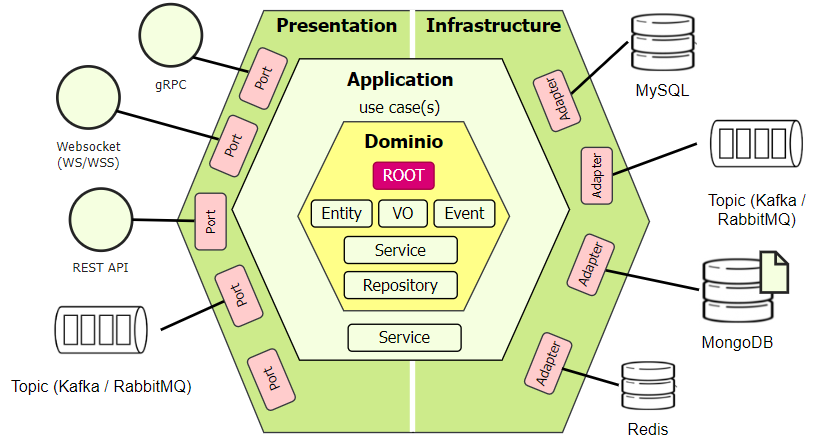
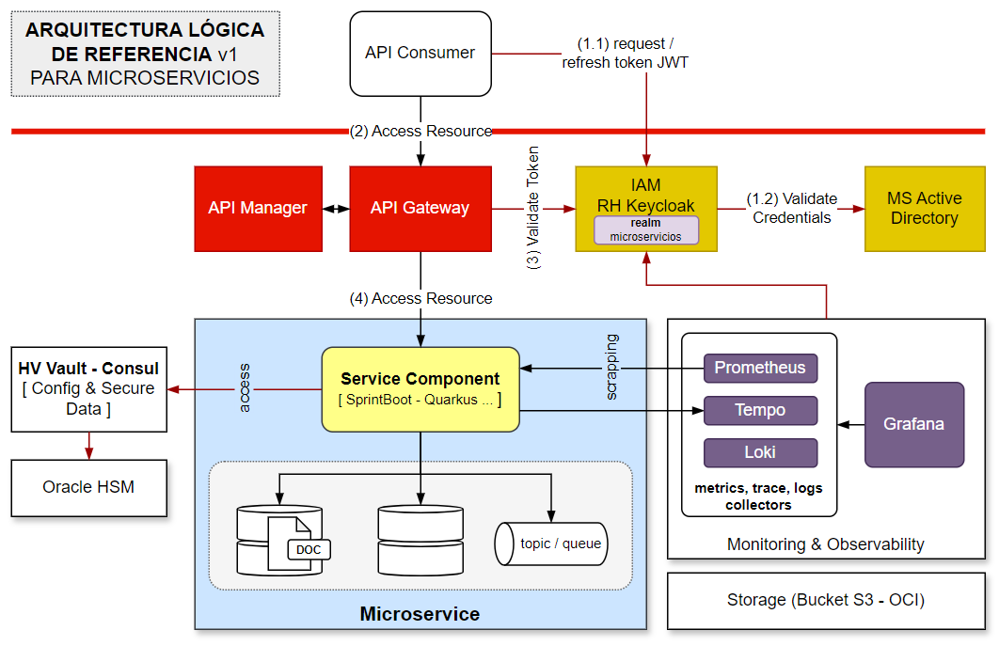
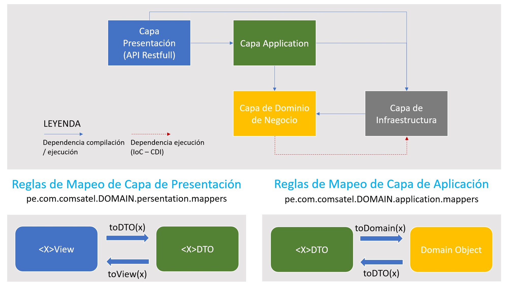
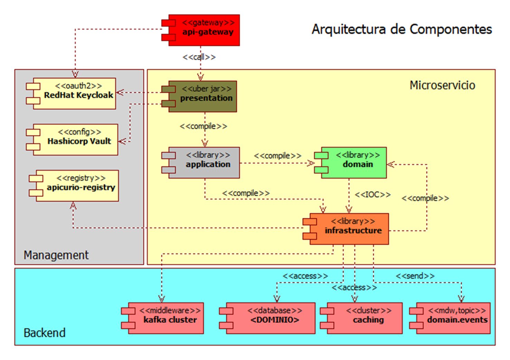
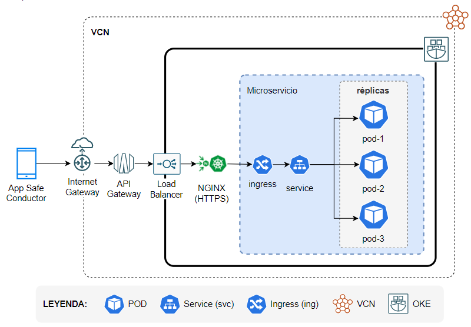
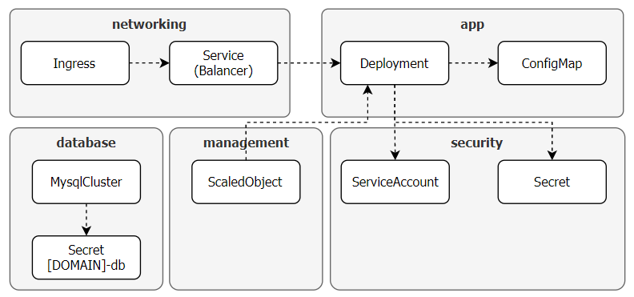

[[_TOC_]]

## Decisiones Arquitecturales

0. [ADR0 Estilo Arquitectural](decisiones-arquitecturales/ADR0-Estilo-Arquitectural)
1. [ADR1 Códigos de Estados HTTP de Respuestas](https://project.comsatel.com.pe/comsatel/development/products/clocator2/svr-basico/collaboration/-/issues/451)
2. [ADR2 Registros de Auditoria](decisiones-arquitecturales/ADR2-Registros-Auditorias)
3. [ADR3 Aseguramiento de Servicios](decisiones-arquitecturales/ADR3-Aseguramiento-Servicios)
4. [ADR4 Aseguramiento de Aplicaciones Web](decisiones-arquitecturales/ADR4-Aseguramiento-Aplicaciones-Web)
5. [ADR5 Aseguramiento de Aplicaciones Móviles](decisiones-arquitecturales/ADR5-Aseguramiento-Aplicaciones-Moviles)
6. [ADR6 Logs](decisiones-arquitecturales/ADR6-Logs)
7. [ADR6 Garantía de Consumo de Servicios](decisiones-arquitecturales/ADR6-Garantia-Consumos)

# Marco Conceptual

La arquitectura del microservicio se basa en el patrón de Arquitectura Hexagonal o de adaptadores y puertos. En esta arquitectura el núcleo se encuentra protegidas por diferentes capas de abstracción; aislando el número (Dominio) de los detalles de implementación provisto por la infraestructura subyacentes.

# Estrutura Lógica de la Arquitectura

La Arquitectura Lógica general de los microservicios incluye una serie de componentes arquitecturales que permiten ofrecer un conjunto de funcionalidades implementadas a través de los componentes del microservicio.

La seguridad de los microservicios se asegura en dos de los tres niveles convencionales. Estos son:

1. Seguridad al Nivel del Canal: se exponen a través de protocolo HTTPS.
2. Seguridad al Nivel de Acceso: se expresa a través de Role-Based Access Control (RBAC) donde a través de `cuentas de servicios/aplicación` habilitadas en `realm` de Keycloak llamado `microservicio`. La cuenta de servicios/aplicación se le otorgan los roles que permiten el acceso granulado a las funcionalidades del microservicio. Se requiere de un token JWT para un acceso seguro al microservicio.

> La Seguridad al Nivel de Mensaje no se encuentra establecida en la arquitectura.

# Organización interna en Capas

Todos los microservicios deben organizarse internamente en un conjunto de capas lógicas, mismas que se presentan en la imagen siguiente:

Las capas y su propósito se explican a continuación:

|Capa|Propósito|
|-|-|
|Presentación|Incluye todos los elementos requeridos para exponer los recursos ("funcionalidades") del microservicios a los consumidores, normalmente a través de API REST usando JSON como forma de representación del estado intercambiado entre el consumidor y el microservicio. Las implementaciones de **Ports** (por ejemplo, API REST u otros) que habilitan el acceso a la funcionalidad de negocio implementada a través de los elementos de la Capa de Aplicación son implementados en esta capa |
|Aplicación|Incluye todos los elementos requeridos para cubrir la implementación, desde una perspectiva de negocio, de los diferentes casos de usos (enmarcadas en las historias de usuario) del microservicio|
|Dominio|Incluye elementos propios del negocio independientes de cualquier tecnogología de implementación. Incluye elementos como son las Root/Aggregates, Entities, Value Object, Repository (su abstraccion) y Domain Events |
|Infraestructura|Incluye los elementos acoplado a la infraestructura base sobre la que se implementa el microservicio. Elementos técnicos ligados a la base de datos, middlewares, protocolos específicos son cubiertos en esta capa. Las implementaciones de los Repository definidos de forma abstracta en la capa de **Dominio** son implementados en esta capa en forma de **Adapters** hacia los elementos de plataformas requeridos.|

# Organización de Componentes

Los componentes que conforman todo el microservicio no solo se limitan a aquellos que implementan directamente lo requerido para el dominio acotado (bounded-context según DDD); sino además, todos aquellos que aseguren proporcionar a los consumidores del microservicios la entrega de las capacidades funcionales y no funcionales comprometidas con el microservicio.

La implementación de lo establecido en la imagen previa se encuentran consolidados en un arquitipo (plantilla) para Maven que integra todos los elementos necesarios derivados de la arquitectura diseñada. 

# Distribución del despliegue

Los microservicios son unidades funcionales con un ciclo de vida completamente independiente de otros microservicios o consumidores. Los microservicios cubren un Dominio o Contexto-Acotado implementados a través de API del tipo REST Full. Todos los componentes que conforman la arquitectura de los microservicios se encuentran mapeados hacia componentes y recursos sobre la Plataforma OKE, según se presenta en la imagen siguiente.

A continuación se describe el propósito de cada uno de los componentes plasmados en la arquitectura del despliegue.

|Componente/Recurso|Propósito|
|-|-|
|Internet Gateway|Este componente de OKE sirve de puente para atraer el tráfico desde internet hacia la VCN configurada en OCI|
|API Gateway|Este componente permite exponer los microservicios desplegados sobre la Plataforma OKE hacia internet, ofreciendo una capa que permite gestionar el uso de los microservicios |
|Load Balancer|Este componente es implementado como un recurso derivado del Ingress de NGINX y que externamente expone la Plataforma OKE a través de un IP Pública. Distribuye la carga de trabajo de las réplicas de los servicios desplegados sobre OKE|
|NGINX|Es el producto que implementa los recursos Ingress requeridos para dar salida a los microservicios y aplicaciones fuera del cluster OKE|
|Ingress|Este componente permite configurar y asignar a los microservicios y aplicaciones un DNS y recursos TLS para habilitar un canal seguro de comunicación sobre HTTPs u otros protocolos. Este componente forma parte integrar del producto NGINX y determina como NGINX se configura para atender las peticiones|
|Service|Este componente constituye un balanceador de carga que distribución las peticiones específicas por cada microservicio hacia las réplicas de los PODs|
|POD|Estos componentes constituyen las implementaciones específicas de la funcionalidad de cada microservicios. Permite a través del escalamiento horizontal mutiplicar la capacidad del microservicios para adaptarse a la demanda cambiante derivada del incremento de los vehículos a gestionar a través de la plataforma|

## Recursos Kubernetes

Como parte de los recursos específicos que se incluyen como parte del despliegue sobre OKE, se tiene lo siguiente, según se incluye en la Carta Helm incluida en el arquetipo de los microservicios.

El despliegue de los microservicios sobre el cluster OKE (Kubernetes) se basa en la configuración de varios recursos (CRD) de kuberentes. Estos incluyen por cada microservicio, recursos en 5 categorías principales:

|*Nro*|*Recursos*|*Descripcion*|
|-|-|-|
|1|Networking|incluye el (a) ingress como mecanismo para atraer el tráfico desde el consumidor hacia el microservicio y el (b) service que constituye un recurso para selección de réplicas de PODs del microservicio y balanceo de la carga de trabajo.|
|2|App|incluye los recursos para el despliegue de los PODs (réplicas) generadas y que de acuerdo con las políticas de auto-escalamiento se pueden incrementar y reducir conforme a la demanda del microservicios y el consumo de recurso CPU, Memoria.|
|3|Management|incluye recursos para gestionar el comportamiento del escalamiento horizontal de las réplicas del microservicio, según demanda y reglas de consumo de recursos CPU y Memoria.|
|4|Security|incluye recursos para gestionar el acceso a recursos del cluster (ServiceAccount) y recursos de servicios requeridos por el microservicio (Secret).|
|5|Database|incluye los recursos para darle soporte a la gestión del estado de los objetos de negocio que forman parte del dominio. Se incluye soporte a través de una base de datos SQL (Relacional), NoSQL (Documental, K/V, columna, etc.)|