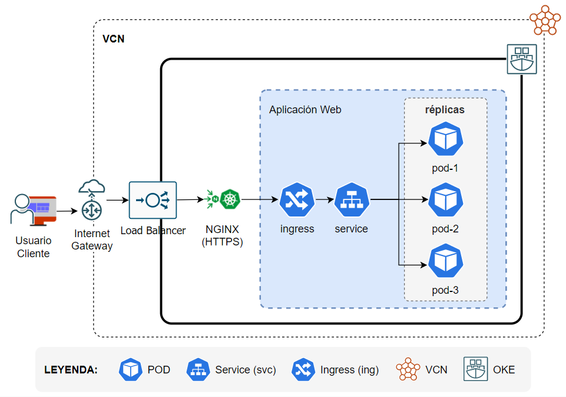
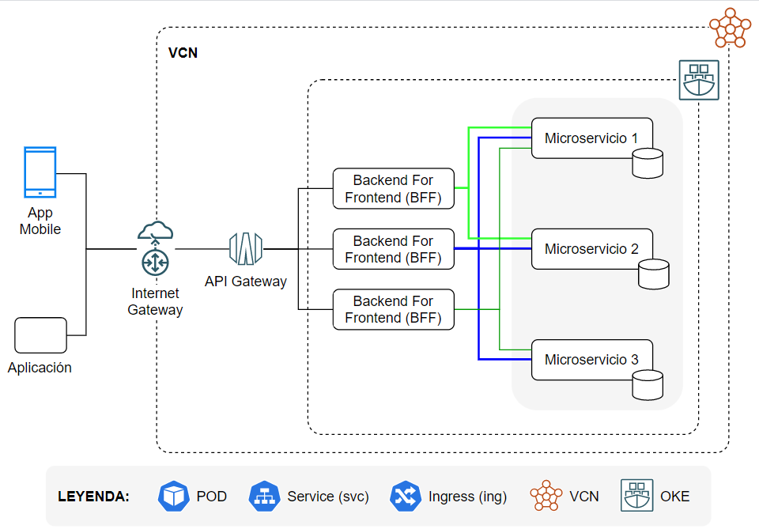

[[_TOC_]]

# Arquitectura de Aplicación Web

Las aplicaciones Web y/o Micro-UI son aplicaciones stateless para Kubernetes. Las aplicaciones serán basadas en Single Page Applicaions (SPA) responsives y serán expuestas externamente al cluster OKE a través del NGINX Ingress Controller sobre protocolo seguro HTTPS con certificado público.

## Elementos Claves

### Ingress

El ingress permite realizar la exposición externa de la aplicación Web fuera del cluster kubernetes. Este recurso deberá cumplir los siguientes lineamientos:

1. Proporcionar enrutamiento HTTP/HTTPS
1. Proporcionar balanceo de carga del tráfico
1. Exponer la aplicación a través de un DNS
1. Proporcionar terminación SSL / TLS para asegurar el canal de comunicación entre el browser y la aplicación.

### Service

Este recurso kubernetes permite balancear la carga de trabajo hacia las réplicas de los Pods que implementan la Aplicación Web. Este recurso deberá cumplir con los siguientes lineamientos:

1. Balanceo 

### Pod

## Servidor

1. NodeJS

## Frameworks

1. Angular
2. React
3. Redux

# Arquitectura de Microservicio

Los microservicios constituyen el core de la solución. Se definen en torno a contextos acotados para dominios específicos del negocio. Los servicios accedidos externamente por aplicaciones consumidores (web, mobile o de terceros) se exponen a través de la capa de API Gateway; nunca de forma directa. 

## Diagrama General

Los diferentes elementos que componen un microservicio se ubican de diferentes capas lógicas, aunque físicamente se integran en una única unidad de despliegue. La arquitectura lóica es la siguiente:

Las capas y su propósito se explican a continuación:

|Capa|Propósito|
|-|-|
|Presentación|Incluye todos los elementos requeridos para exponer los recursos ("funcionalidades") del microservicios a los consumidores, normalmente a través de API REST usando JSON como forma de representación del estado intercambiado entre el consumidor y el microservicio. Las implementaciones de **Ports** (por ejemplo, API REST u otros) que habilitan el acceso a la funcionalidad de negocio implementada a través de los elementos de la Capa de Aplicación son implementados en esta capa |
|Aplicación|Incluye todos los elementos requeridos para cubrir la implementación, desde una perspectiva de negocio, de los diferentes casos de usos (enmarcadas en las historias de usuario) del microservicio|
|Dominio|Incluye elementos propios del negocio independientes de cualquier tecnogología de implementación. Incluye elementos como son las Root/Aggregates, Entities, Value Object, Repository (su abstraccion) y Domain Events |
|Infraestructura|Incluye los elementos acoplado a la infraestructura base sobre la que se implementa el microservicio. Elementos técnicos ligados a la base de datos, middlewares, protocolos específicos son cubiertos en esta capa. Las implementaciones de los Repository definidos de forma abstracta en la capa de **Dominio** son implementados en esta capa en forma de **Adapters** hacia los elementos de plataformas requeridos.|

## Elementos Claves

A continuación se definen cada uno de los componentes claves que conformar el microservicios desde el punto de su exposición para consumo hasta el punto de backend(s) que soportan la persistencia de los objetos enmarcados en el dominio acotado que define al microservicio.

### API Gateway

> Colocar descripción del elemento.

### Load Balancer

> Colocar descripción del elemento.

### NGINX Ingress Controller

> Colocar descripción del elemento.

### Ingress

> Colocar descripción del elemento.

### Service

> Colocar descripción del elemento.

### PODs

> Colocar descripción del elemento.

# Backend for Frontend

Los Backends For Frontends constituyen soluciones que permiten:

1. Adaptar los backends (en nuestro caso los microservicios) a las características propias del frontend.
2. Constituyen una capa de anti-corrupcción que protege las APIs de los microservicios.
3. Mejorar el performance y la experiencia (UX) del usuario final proporcionando un backend optimizado para el canal consumidor (frontend).
4. Evitar realizar múltiples peticiones del frontend hacia los microservicios requeridos.

# Arquitectura de Aplicación Spark
> Describir la arquitectura

# Arquitectura para Data Flow

## Diagrama General

## Elementos Claves
### [Change-Data Captura (CDC)](arquitectura/patrones/notificaciones-eventos-dominio)
Componente que permite monitorear los cambios que se producen en tablas de la base de datos origen y publica los cambios detectados, de acuerdo a la ventana de tiempo definida, y lo coloca en tópico destino para la transformación y distribución hacia depósito destino.

## Middleware (Broker) de Mensajeria (Apache Kafka)
Componente que recibe en tópico por tabla monitoreada los registros obtenidos del origen de datos y lo hace disponible para su uso por el/los consumidores interesados en la publicación del tópico correspondiente por tabla monitoreada.

## OLAP (Apache Pinot)

Componente que permite realizar el procesamiento análítico en tiempo real de los datos obtenidos desde el tópico Kafka donde se ha depositado los registros transformados obtenidos desde el origen de datos. 

