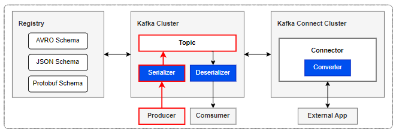
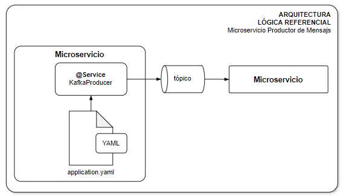

[[_TOC_]]

# Integración Asíncrona con Apache Kafka

## Problema

Los siguientes son problemas tipicos donde aplica el patrón:

1. Cambios en la información de una entidad de un dominio de la que dependen otros dominios.
2. Informar a otros dominios lo ocurrencia de un `evento de negocio` de su interés.

## Solución

A continuación se presenta la solución lógica que cubre el patrón. El siguiente diagrama presenta los componentes principales de la solución.



Para el caso del Productor de mensajes hacia otros interesados (microservicios), la arquitectura lógica con los componentes requeridos es la siguiente:



Algunas anotaciones importantes:

1. La comunicación entre productor y consumidores de mensajes siempre se realiza de forma asíncrona.
2. Se debe realizar auto-commit sobre el envío del mensaje
3. Los tópicos se crean de forma automática con el primer consumidor (a revisar por las configuraciones que pudieran requerirse sobre el tópico)
4. Los tópicos deben estar configurados con replicación para asegurar disponibilidad de mensajes a los grupos de consumidores ante caida de nodos del cluster.

## Implementacion

Para la implementación de este patrón se ha realizado lo siguientes:

El envío de mensajes a través de un canal asíncrono como es el caso de tópicos con Apache Kafka se deberá realizar usando el patrón `Producer`. Para ello, se sugiere disponer de una clase KafkaProducer ubicada en capa de `Infraestructura` de forma similar al que se indica en el siguiente snip de código.

```java

@Slf4j
@Service
public class ProducerTransformation {
    private final KafkaTemplate<String, JsonTramas> kafkaTemplate;
    private final String topico;

    public ProducerTransformation(KafkaTemplate<String, JsonTramas> kafkaTemplate,
                                  @Value("${topico-transformacion}") String topico) {
        this.kafkaTemplate = kafkaTemplate;
        this.topico = topico;
    }

    public void send (JsonTramas jsonTramas) {
        log.info("Send message kafka {} ", jsonTramas);
        kafkaTemplate.send(topico, jsonTramas);
    }
}
```

Se requiere una configuración de parametría para asegurar los aspectos de conectividad del adaptador de SpringBoot para Kafka. La configuración base es la siguiente (puede ser mejoradas por aspectos de seguridad):

|Parametro|Signigicado|
|-|-|
|USUARIO|Usuario designado para conexión con Apache Kafka|
|PASSWORD |Contraseña del usuario (proporcionada por Infraestructura)|

```yamk
spring:
  kafka:
    listener:
      logging:
        enabled: false
    properties:
      security.protocol: SASL_PLAINTEXT
      sasl.mechanism: PLAIN
      sasl.jaas.config: org.apache.kafka.common.security.plain.PlainLoginModule required username="USUARIO" password="PASSOWRD";
    consumer:
      bootstrap-servers: kafka.middleware.svc.cluster.local:9092
      group-id: grupo_id
      auto-offset-reset: earliest
      delete.after.read: true
      key-deserializer: org.apache.kafka.common.serialization.StringDeserializer
      value-deserializer: org.apache.kafka.common.serialization.StringDeserializer
      properties:
        spring.json.trusted.packages: java.util,java.lang,pe.com.comsatel.telemetria.application.model
        enable.auto.commit: true
    producer:
      bootstrap-servers: kafka.middleware.svc.cluster.local:9092
      key-serializer: org.apache.kafka.common.serialization.StringSerializer
      value-serializer: org.springframework.kafka.support.serializer.JsonSerializer
```

## Referencias

1. [SpringBoot Mensajería con Kafka]([https://](https://docs.spring.io/spring-boot/reference/messaging/kafka.html))