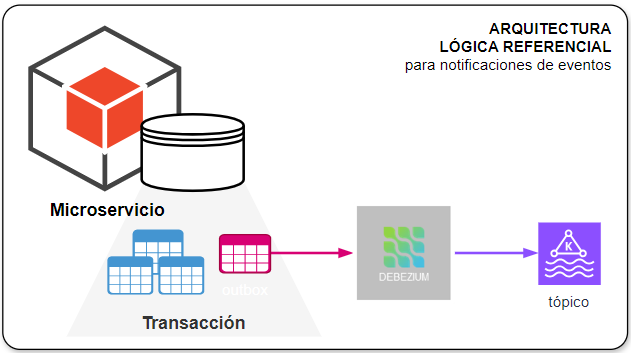
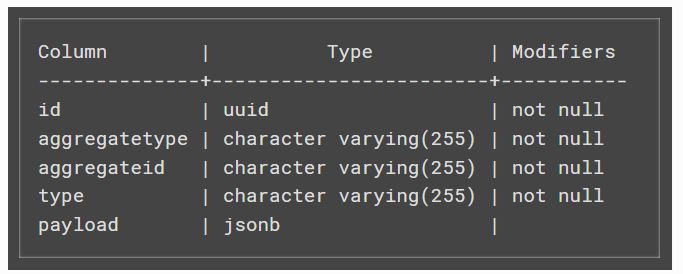

[[_TOC_]]

# Notificaciones de Eventos de Dominio

## Problema

Los siguientes son problemas tipicos donde aplica el patrón:

1. Cambios en la información de una entidad de un dominio de la que dependen otros dominios.
2. Informar a otros dominios lo ocurrencia de un `evento de negocio` de su interés.
3. Reducir llamadas entre microservicios por la segregación de las bases de datos de cada microservicios.

## Solución

A continuación se presenta la solución lógica que cubre el patrón.

La estructura de la tabla para tb_outbox se ajusta a lo siguiente:

Algunas anotaciones importantes:

1. La lógica transaccional incluye el registro del evento correspondiente en la tabla `tb_outbox` para asegurar que tanto las tablas transaccionales y outbox se procesen como una unidad.
2. La operación sobre la tabla `tb_outbox` conlleva insertar y eliminar el registro que contiene la información del evento.
3. La plataforma CDC `Debezium` extrae el logs de las operaciones de la base de datos (filtrando solo las inserciones)
4. Los eventos recibidos por CDC se publican en tópico o cola para que todos los interesados extraigan de esta la información específica del evento.
5. Los servicios interesados realizan el tratamiento de la información del evento de acuerdo con sus necesidades.

## Implementacion

Para la implementación de este patrón se ha realizado lo siguientes:

1. Se ha creado una tabla `tb_outbox` en el esquema de cada microservicio.
2. Se ha habilitado un usuario `cdcuser` con permisos de acceso a log de la BD (binlog o wal)
3. Se ha creado un tópico / cola en middleware de mensajería (Kafka o RabbitMQ)
4. Se ha configurado un conector por cada microservicio en `Debezium`.

## Referencias

1. [Pattern: Transactional outbox](https://microservices.io/patterns/data/transactional-outbox.html)