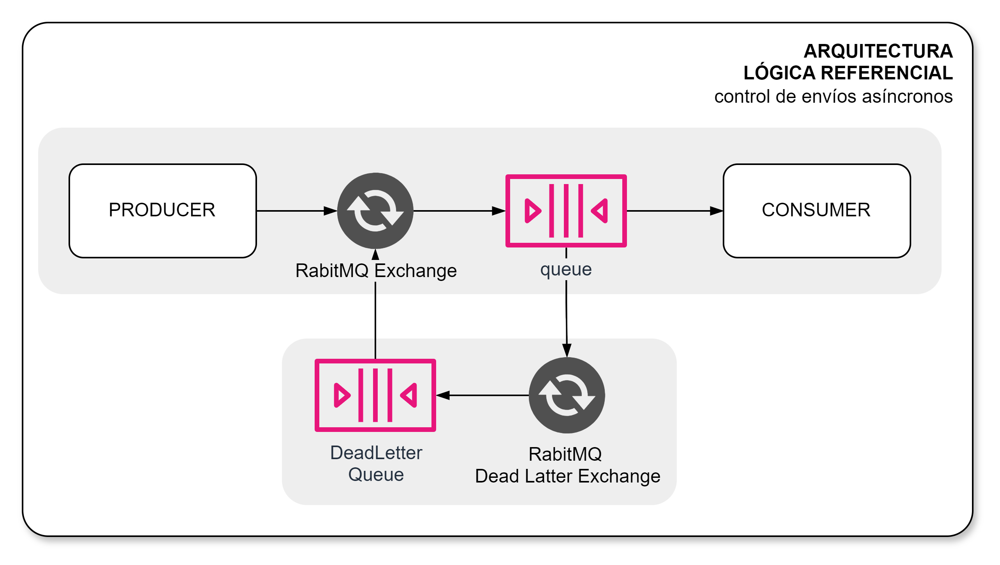
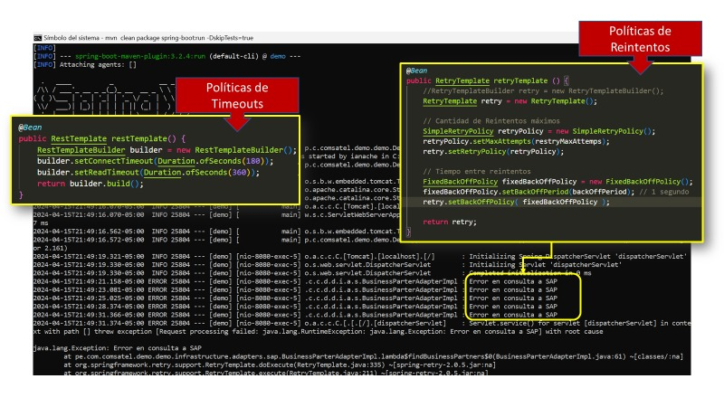
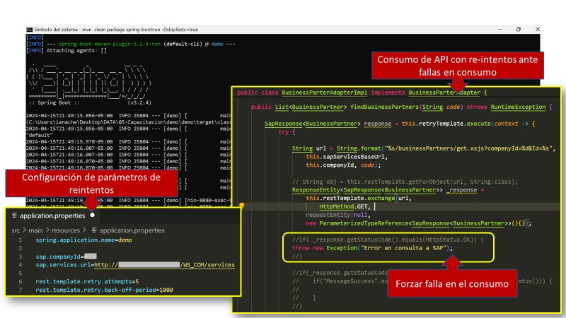

[[_TOC_]]

# Consumo de Servicios con Reintentos

## Problema

Se requiere consumir un servicio y se produce falla para lograr el consumo de la funcionalidad requerida por situaciones de conectividad, respuesta en tiempo requerido o mal comportamiento del servicio.

## Solución

### Integración Síncronas

La solución al problema planteado se debe realizar de acuerdo con los siguientes lineamientos:

1. Se debe capturar falla de conectividad e intentar un mínimo de 3 veces.
2. Se debe establecer tiempos incrementales entre los reintentos para evitar saturar el servicio consumido.
3. Se debe capturar falla por tiempos superiores a 2 segundos (estándard) de entrega de una respuesta de parte del servicio consumido. Son 2 segundos el umbral establecido para los servicios de todas las plataformas de COMSATEL.

### Integraciones Asíncronas

Para operaciones asíncronas se debe considerar lo siguiente:

1. Se debe establecer derivar el mensaje de petición fallido hacia una cola de RabbitMQ con reintentos automáticos (default: 3 reintentos)
2. Se debe remitir los mensajes fallidos hacia una cola de tipo `DeadLetter` donde permanecerán los mensajes hasta su envío final.

## Implementación

### Integraciones Síncronas

Para la implementación del patrón se ha optado por lo siguiente (implementados a través del arquetipo de microservicios):

1. Uso de RetryTemplate con las configuraciones de cantidad de reintentos y tiempos de espera entre reintentos

2. Uso de RestTemplate con las configuraciones sobre tiempos limites (TimeOut) de connexión y espera de respuesta.

Para el consumo del servicio asíncrono:

## Referencias
