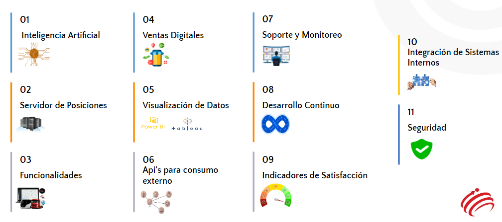

[[_TOC_]]

# Pilares Generales de la Arquitectura

Los pilares generales que gobiernan los diferentes aspectos de la arquitectura de la solución se encuentran resumidos en nueve (9) pilares (ver documento CLocator 2 Pilares de la Solución v1.0.docx adjunto). 

# Detalle de los Pilares

## Pilares Comunes

### Visualización de Datos

### API para Consumos Externos

### Soporte y Monitoreo

### Desarrollo Continuo

### Seguridad

## CLocator 2

### Inteligencia Artificial

### Servidor de Posiciones

### Funcionalidades

### Ventas Digitales

### Indicadores de Satisfacción

### Integración con Sistemas Internos
