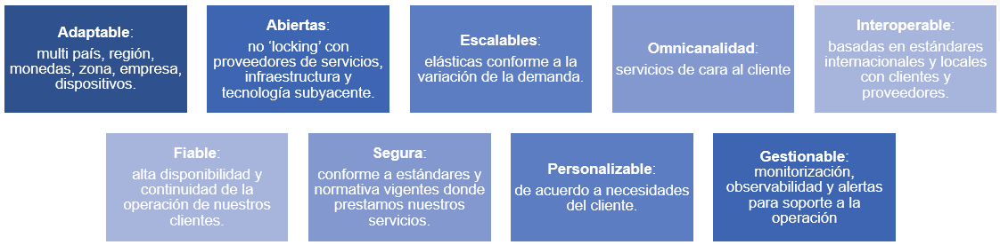

[[_TOC_]]

# Principios Generales de la Arquitectura

Los principios generales que gobiernan los diferentes aspectos de la arquitectura de la solución se encuentran resumidos en nueve (9) principios alineados con los [Pilares de la arquitectura de la solución](documentos). 

Adicionalmente, la nueva arquitectura se sustenta en Nueve Principios Arquitecturales que se resumen a continuación:

## Principio 1: Soluciones Adaptables

### Lineamientos Arquitecturales

#### LA1.1 Flexibilidad en la incorporación de nuevos dispositivos (marcas y modelos)

* La arquitectura deberá permitir que se incorporen nuevos dispositivos (marcas y modelos) con nuevos protocolos y tramas de telemetría y control sin la necesidad de modificaciones a los componentes (microservicios) que procesan la telemetría.
* La incorporación de nuevos dispositivos (marcas y modelos) debe ser tratado a través de configuración sobre los componentes arquitecturales existentes de la arquitectura (se debe evitar crear nuevos componentes a la medida por cada protocolo) para procesamiento de telemetría.
* La solución se enfocará de forma primaria sobre una estrategia de configuración de nuevos protocolos (incluyendo facilidades para pruebas de los nuevos protocolos) en contraposición al desarrollo a la medida para cada protocolo reduciendo el time-to-market.

#### LA1.2 Adecuación a las preferencias de cada cliente (empresa)

* Los componentes **frontend** (Web, App Mobile) debe permitir que los clientes adecuen el Look & Feel a sus requerimientos institucionales para asegurar su identidad ante sus clientes finales.
* Los componentes **frontend** (Web, App Mobile) deben asegurar que los contenidos (textos, términos, etiquetas) se ajusten al contexto y requerimientos del cliente.

#### LA1.3 Adaptación a la región / zona de ubicación del cliente

* Toda la información que involucre fecha y hora debe ser tratada de acuerdo a la zona horaria del cliente.
* Todo el procesamiento que involucre información de fecha y hora debe operar tomando en consideración la zona horaria del cliente.

#### LA1.4 Integración con sistemas de terceros

* Se debe proporcionar mecanismos estándares para la integración con los sistemas de asociados de negocios en los países donde el Backoffice de Comsatel no soporte completamente la operación del negocio.

## Principio 2: Soluciones Abiertas

Las soluciones deben evitar fuerte acoplamiento (dependencia fuerte o de forma restrictiva) de un **único** proveedor, plataforma o tecnología subyacente que evite que estas puedan ser portadas o migradas hacia un nuevo contexto tecnológico (nuevo proveedor de servicios, plataforma equivalente o tecnología subyacentes equivalentes)

### Lineamientos Arquitecturales

#### LA2.1 No locking con un único proveedor tecnológico

* Las decisiones sobre todo bloque de construcción de la solución deben ser formuladas asegurando que estos puedan ser trasladado hacia y operen sobre facilidades (servicios) de diferentes proveedores tecnológicos.

#### LA2.2 Uso de estándares de industria

* Las decisiones deben basarse dando prioridad al uso de estándares tecnológicos de industria.
* Las decisiones arquitecturales se deben basar es la aplicación de las buenas prácticas y estándares de industria.

## Principio 3: Soluciones Escalables

### Lineamientos Arquitecturales

#### LA3.1 Debe adaptarse a escenarios de operación según demanda

* Capacidad para escalar la capacidad de la infraestructura y plataforma ante aumentos de la demanda (transaccionalidad).
* Capacidad para reducar la capacidad de la infraestructura y plataforma ante la disminución de la demanda a los niveles habituales (normales de operación).

#### LA3.2 Cumplimiento de Acuerdos de Niveles/Objetivos de Servicio

* Capacidad para entregar tiempos de respuestas requeridos en diferentes escenarios de operación.
* Capacidad para procesar la demanda de transacciones requeridos en diferentes escenarios de operación.

## Principio 4: Soluciones Omnicanales / Multicanales

### Lineamientos Arquitecturales

#### LA4.1 Multicanalidad

* Capacidad para entregar vía canal Web los servicios y funcionalidades de acuerdo con el perfil de usuarios finales.
* Capacidad para entregar vía canal App Mobile (iOS y Android) los servicios y funcionalidades de acuerdo con el perfil de usuarios finales.
* Capacidad para entregar servicios y funcionalidades asegurando el mayor nivel de cobertura posible de acuerdo con los canales de acceso de nuestros clientes y usuarios finales.

#### LA4.2 Omnicanalidad

* Capacidad para entregar una misma experiencia de usuario con independencia del canal de acceso a los servicios y funcionalidades.

## Principio 5: Soluciones Interoperables

### Lineamientos Arquitecturales

#### LA5.1 Operar con diversas tecnologías

* Capacidad para soportar diferentes lenguajes de programación de acuerdo con las necesidades técnicas y de negocio.
* Capacidad para operar sobre tecnologías y/o servicios de propósito similar para evitar lock-in con algún proveedor tecnológico.

#### A5.2 Alineamiento con estándares de facto

* Capacidad para integrarse con soluciones internas y externas basada en uso extensivo de estándares de industria.
* Empleo de estándares propios solo en situaciones donde no exista o no sea efecto en costo el uso de estándares de industria.

## Principio 6: Soluciones Fiables

Las soluciones deben tener la capacidad de ofrecer servicios conforme al SLA anual (disponibilidad) por COMSATEL; asegurando alta disponibilidad (evitar únicos puntos de fallas) y continuidad de la operación de los clientes internos y externos.

### Lineamientos Arquitecturales

#### LA6.1 Disponibilidad

* Asegurar la disponibilidad de componentes críticos de la solución.

#### LA6.2 Cumplimiento de Acuerdos de Servicio

* Asegurar cumplimiento de SLA comprometidos con nuestros clientes.
* Asegurar cumplimiento de SLO comprometidos con nuestros clientes.

## Principio 7: Soluciones Seguras

### Lineamientos Arquitecturales

#### LA7.1 Cumplimiento ("compliance")

* Capacidad de proporcionar un contexto seguro para las operaciones de negocios.
* Soporte a los requerimientos de seguridad de nuestros clientes.
* Cumplimiento normativas, políticas y estándares vigentes de COMSATEL.

#### LA7.2 Logs de auditoría

* Registro de todas las operaciones realizadas sobre la plataforma.
* Aseguramiento de los datos sensibles registrados.
* Consulta de la información de auditoría.

## Principio 8: Soluciones Personalizables

### Lineamientos Arquitecturales

#### LA8.1 Personalización

* Capacidad de ser personalizadas al nivel del Look and Feel según necesidades de nuestros clientes.
* Capaci para adaptarse según el lenguaje y preferencias de nuestros clientes (contenido de etiquetas y contenidos)

#### LA8.2 Regional

* Soporte a multi-idiomas.
* Soporte a zona horaria según preferencias del cliente y usuario.
* Soporte a moneda según preferencias del cliente y usuario.
* Soporte a unidades de medidas según preferencias del cliente y usuario.

## Principio 9: Soluciones Gestionables (Observabilidad)

### Lineamientos Arquitecturales

#### LA9.1 Exposición de métricas estándares

* Los componentes DEBEN exponer las métricas de su comportamiento a través del protocolo de exposición de Prometheus.
* La plataforma DEBE tener configurado los niveles de alertas como mínimo para casos de consumo de CPU y Memoria que excedan un umbral del `80%` del uso del recurso.
* Las alertas DEBEN ser notificadas en línea en el momento que estás ocurran y de acuerdo con las preferencias del interesado.

#### LA9.2 Explotación de registros (logs)

* Registro de actividad de los diferentes componentes de la plataforma en logs.
* Retención de los registros de acuerdo con políticas establecidas y requerimientos de los clientes.
* Visualización y consulta de los registros generados.

#### LA9.2 Trazabilidad (tracing) de las transacciones

* Registro de métricas de trazabilidad de las transacciones.
* Visualización y consulta de la trazabilidad de las transacciones.

#### LA9.3 Explotación de métricas

* Visualización de métricas a través de Dashboards personalizables.
* Generación de Alertas de acuerdo con reglas establecidas.
* Entregas de alertas por diferentes canales (por ejemplo, Mattermost, Slack, Correos, otros)