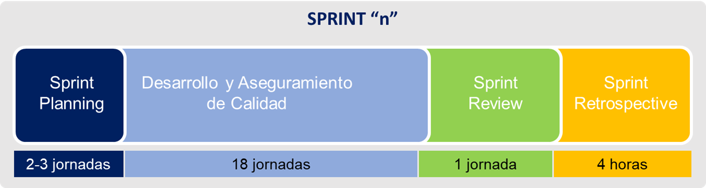

[[_TOC_]]

# Introducción

La Guía de SCRUM define tres (3) áreas claves que deben ser enfocadas en el Sprint Planning:

1. ¿Cómo el sprint podrá añadir valor? Responder a esta pregunta significa `determinar el objetivo del sprint`
2. ¿Qué trabajo puede hacerse en el sprint? Responder a esta pregunta significa `determinar cómo alcanzar el objetivo del sprint` tomando en consideración el `Backlog priorizado del producto` y que el resultado debe ser un `incremento de valor`.
3. ¿Cómo el trabajo será realizado? Se descomponen los items del backlog en `trozos de trabajo` a ser completados en el sprint (para nosotros `tareas`)

> El finalizar este evento el equipo SCRUM queda `comprometido` con (1) objetivo del sprint, (2) alcance del sprint (items del backlog - _user stories_) y un (3) plan de acción para alcanzar el objetivo.

# Objetivo

Establecer el compromiso del equipo SCRUM con el cliente del producto sobre el alcance del Sprint. La estructura general del Sprint debe ser conforme a lo indicado en el siguiente gráfico.

# Lineamientos

* Participan de **forma obligatoria** Product Owner, SCRUM Master, Equipo SCRUM.
* Se realiza durante la última semana del mes y completa previo al 1er día útil del mes asignado al Sprint.
* Se toman las historias de usuarios según la priorización realizada en las [Reunión de Priorización del Producto](reunion-priorizaci%C3%B3n-producto)
* El alcance se acota de acuerdo con un time-box de 18 jornadas útiles de trabajo.
* El esfuerzo disponible del Equipo SCRUM se acota al desempeño del equipo en el mes previo [Distribución de Issues por Tipo - según el producto](https://superset.dev.comsatel.com.pe/superset/dashboard/3/?native_filters_key=w6N5rZWF-Bss54qbRc1zAeWSS2TA6VFbkNJV_T2p5WiwNrSsDtD2KeVQPxzMZiPf)
* El Equipo SCRUM determina el esfuerzo requerido para alcanzar la condición de "Hecho" de la tarea y los Criterios de Aceptación.
* El Equipo SCRUM deberá utilizar las métricas recolectada en Sprints y la experiencia acumulada del equipo.
* Se debe asegurar que el esfuerzo estimado para las tareas de una historia y el esfuerzo estimado de la historia guarden relación.
* Las tareas deben tener definida y registrada en la plataforma GitLab las horas estimadas.
* Todas las tareas deben estar vinculadas (linked) con la historia a la que corresponden y cubrir el contenido definido en la **Plantilla de la Tarea**.
* Se debe incluir una tarea donde se registren las reuniones diarias del Sprint de acuerdo con la Plantilla `daily-meeting` [Plantilla base](https://project.comsatel.com.pe/comsatel/development/metodologia/-/blob/main/.gitlab/issue_templates/daily-meeting.md)
* Se debe incluir una tarea donde se registre la minuta del Sprint Review de acuerdo con la Plantilla `sprint-review` [Plantilla base](https://project.comsatel.com.pe/comsatel/development/metodologia/-/blob/main/.gitlab/issue_templates/sprint-review.md)
* Se debe incluir una tarea donde se registre la minuta del Sprint Retrospective de acuerdo con la Plantilla `sprint-retrospective` [Plantilla base](https://project.comsatel.com.pe/comsatel/development/metodologia/-/blob/main/.gitlab/issue_templates/sprint-retrospective.md)

# Criterios de Hecho ("Done")

* Se ha definido un objetivo claro y preciso para el sprint.
* Se ha comprometido un alcance del sprint como un sub-conjunto de Items del Backlog del Producto (PBI) de la más alta prioridad para el cliente.
* Todas las historias de usuario se encuentran debidamente especificadas y aseguradas por el equipo de QA.
* Todas las tareas para cumplir el objetivo y los PBI se encuentran debidamente especificadas, el esfuerzo estimado (talla de t-shirt, u otro) y definidas

# Archivos Adjuntos

1. [Composicion_Sprint_Artifacts.pptx](../documentos/Composicion_Sprint_Artifacts.pptx)