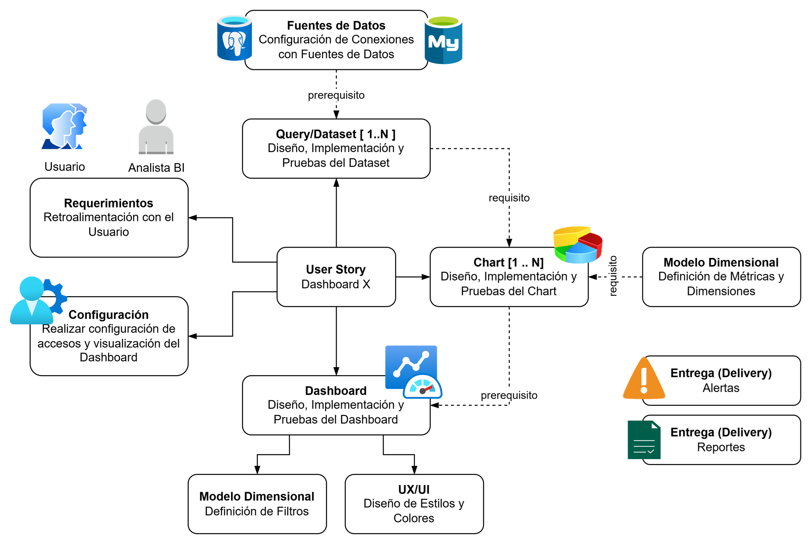

[[_TOC_]]

# Metodologia de Trabajo

Aunque la presente metodología se basa en el uso de Apache Superset debemos entender que esta tecnología es solo el habilitador de una estrategia de datos y que a futuro pudiera ser reemplazada parcial o totalmente en base a los requerimientos de negocio. En este enfoque, el KPI (Key Performance Indicator) no es solo un número en una pantalla, sino el eje gravitacional que dicta el diseño de todas las capas inferiores.

Bajo el marco de TOGAF, podemos mapear el Marco Metodológico (flujo) de desarrollo del Dashboard con los Building Blocks (ABBs) de la infraestructura técnica (basado en Apache Superset). Esta relación asegura que cada paso del desarrollo tenga un sustento en la arquitectura de contenedores.

(Fuente: imagen generada con Google Gemini: Generar un gráfico que visualice las fases anteriores, estableciendo la secuencia entre ellos como un flujo de trabajo. Utilizar estilo "Textured Storybook")

A continuación, se detalla la descripción detallada de la arquitectura de desarrollo y ejecución.

## Fase de Requerimientos y Configuración (Business & Data ABBs)

En esta etapa inicial, los actores definen el alcance basado en necesidades de negocio. Metodológicamente, un Dashboard fracasa si no resuelve una pregunta de negocio. El KPI es el punto de partida de la User Story.

- **Identificación del Proceso de Negocio**: Antes de conectar tablas, se debe definir qué decisión se quiere optimizar.
- **Anatomía del KPI**: Se debe documentar la fórmula de cálculo, la unidad de medida, la frecuencia de actualización y, lo más importante, los umbrales de éxito (qué valor es "bueno" y qué es "alerta").
- **Análisis de "Drill-down"**: Definir qué dimensiones (tiempo, región, producto) permiten explicar una variación en el KPI.

Los siguientes aspectos claves son los que unen el requerimiento de analítica de datos con la metodología basada en SCRUM y la plataforma tecnológica:

- **Gestión de Requerimientos**: El Analista BI y el Usuario Negocio interactúan para definir la User Story del Dashboard.
- **Gobierno de Acceso**: La Configuración de accesos y visualización se apoya en el bloque Redhat Keycloak para garantizar que solo usuarios autorizados interactúen con los datos.
- **Conectividad**: Se establecen las Fuentes de Datos (PostgreSQL, MySQL, etc.), las cuales son gestionadas técnicamente por el contenedor Superset [Web].

## Fase de Diseño de Datos (Information Systems ABBs)

Aquí se transforma el dato crudo en información útil para el negocio. Independientemente de si usamos SQL o Python, esta fase define la estructura de la verdad.

- **Alineación con el KPI**: El Modelo Dimensional se construye para soportar el KPI. Si el KPI es "Ventas Mensuales", el modelo debe garantizar una dimensión de tiempo granular y una métrica de monto.
- **Garantía de Calidad (Data Quality)**: Establecer reglas de limpieza y transformación para que la métrica sea confiable y auditable.

Los siguientes aspectos claves son los que unen el requerimiento de analítica de datos con la metodología basada en SCRUM y la plataforma tecnológica:

- **Query/Dataset [1..N]**: Es el bloque lógico donde se diseñan e implementan las consultas SQL.
- **Persistencia de Definiciones**: Toda la lógica de los datasets y el Modelo Dimensional (métricas y dimensiones) se almacena en el bloque metadata/ODS [PostgreSQL].
- **Inicialización**: El componente Init-DB asegura que los esquemas de base de datos necesarios para estos nuevos datasets estén actualizados.

## Fase de Construcción de Visualizaciones (Application ABBs)

En esta fase se materializa la capa analítica para el usuario final. El objetivo es reducir la carga cognitiva del usuario para que entienda el KPI en segundos.

- **Jerarquía Visual**: El KPI principal debe ocupar el lugar más destacado (arriba a la izquierda). Los Charts secundarios deben servir solo para explicar el comportamiento de ese KPI.
- **Contextualización**: Un KPI sin contexto es inútil. El diseño debe incluir comparativos (ej. Actual vs. Meta, o Actual vs. Año Anterior).
- **Interactividad con Propósito**: Los Filtros deben permitir al usuario "navegar" el KPI para encontrar la causa raíz de un problema.

4. Fase de Operación y Mejora Continua (Ciclo de

Los siguientes aspectos claves son los que unen el requerimiento de analítica de datos con la metodología basada en SCRUM y la plataforma tecnológica:

- **Chart [1..N]**: El diseño y las pruebas de los gráficos son procesados por el contenedor Superset [Web].
- **Optimización de Carga**: Para mejorar el rendimiento de los gráficos y filtros (UX/UI), se utiliza el bloque Cache/Broker [Redis], que almacena temporalmente los resultados de las consultas.
 - **Integración del Dashboard**: El ensamblaje final de gráficos y filtros se consolida como un objeto lógico dentro de la base de datos de metadatos.

## Fase de Entrega y Operación (Technology ABBs)

En esta fase se distribuye el valor de forma continua y automatizada. Una vez entregado, el Dashboard entra en una fase de mantenimiento basada en la relevancia del KPI.

- **Monitoreo de Relevancia**: Si un KPI ya no es utilizado para tomar decisiones, el Dashboard debe ser dado de baja o rediseñado.
- **Gestión de Excepciones**: Las Alertas se disparan solo cuando el KPI cruza los umbrales críticos definidos en la fase 1, evitando la fatiga de información.

Los siguientes aspectos claves son los que unen el requerimiento de analítica de datos con la metodología basada en SCRUM y la plataforma tecnológica:

- **Procesamiento de Tareas**: La generación de Reportes y Alertas (Entrega/Delivery) no sobrecarga el servidor web, ya que es delegada al componente worker.
- **Orquestación Temporal**: El bloque celerybeat se encarga de agendar estas tareas de entrega (reportes programados) enviando las órdenes a través de Redis.

## Aspectos Relevantes

| Elemento Metodológico    | Función en la Analítica     | Vínculo con el KPI                                          |
|--------------------------|-----------------------------|-------------------------------------------------------------|
| User Story               | Define el "Para qué"        | El éxito de la historia se mide por la visibilidad del KPI. |
| Métricas y Dimensiones   | Estructura técnica del dato | Son los ladrillos que construyen la fórmula del KPI.        |
| Configuración de Alertas | Proactividad del sistema    | Se activan cuando el KPI sale de su rango normal.           |
| Reportes Programados     | Empuje de información       | Distribuyen el estado del KPI a los interesados.            |

## Dependencias claves

| Componente de Desarrollo (Proceso) | Building Block de Soporte (Arquitectura) | Función Clave                            |
|------------------------------------|------------------------------------------|------------------------------------------|
| Datasets / Queries                 | metadata/ODS (PostgreSQL)                | Almacenar definiciones y conexiones.     |
| UX/UI / Filtros                    | Cache/Broker (Redis)                     | Velocidad de respuesta y caché de datos. |
| Alertas / Reportes                 | worker & celerybeat                      | Ejecución asíncrona y programada.        |
| Acceso / Seguridad                 | Redhat Keycloak                          | Validación de identidad del usuario.     |

# Plataforma de Analitica de Datos

## Plataforma para Visualización y Análisis

### Apache Superset

Basado en el diagrama proporcionado, a continuación se presenta una descripción detallada de la arquitectura de Apache Superset utilizando la terminología de TOGAF, estructurándola a través de Architecture Building Blocks (ABBs) o Bloques de Construcción de Arquitectura.

Esta arquitectura sigue un modelo de Diagrama de Contenedores (Nivel 2 del modelo C4), que dentro de TOGAF se clasifica principalmente en las fases de Arquitectura de Sistemas de Información (Datos y Aplicaciones).

#### Business Architecture Building Blocks (B-ABBs)

Estos representan los actores y roles que interactúan con el sistema para cumplir con los objetivos de negocio.

- **Usuario Negocio [Person]**: Representa al consumidor final de la información. Su función es realizar análisis y toma de decisiones basadas en los datos visualizados.
- **Analista BI [Person]**: Actor técnico responsable del diseño, implementación y publicación de soluciones de Business Intelligence (dashboards, métricas, datasets).

#### Application Architecture Building Blocks (A-ABBs)

Son los componentes de software (contenedores) que ejecutan la lógica de negocio y gestionan las funcionalidades del sistema.

- **Superset [Container: Web]**: Es el bloque central de la interfaz de usuario. Actúa como el servidor web que gestiona peticiones HTTP y API. Es stateless (sin estado), lo que permite escalabilidad horizontal. Se encarga de la autenticación y el renderizado de visualizaciones.
- **Worker [Container: Web/Python]**: Bloque encargado del procesamiento asíncrono. Ejecuta tareas pesadas (consultas SQL complejas, generación de reportes) para liberar de carga al servidor web principal.
- **Celerybeat [Container: Scheduler]**: Actúa como el orquestador o programador de tareas. No ejecuta la lógica, sino que envía órdenes al Broker para que los Workers ejecuten tareas periódicas como alertas o suscripciones.
- **Init-DB [Container: Python]**: Un componente de ciclo de vida (Job efímero). Se encarga de la inicialización y actualización (upgrade) de los esquemas en la base de datos de metadatos.

#### Data Architecture Building Blocks (D-ABBs)

Representan cómo se gestionan, almacenan y fluyen los datos dentro del sistema.

- **Metadata/ODS [Container: PostgreSQL]**: El almacén de persistencia crítica. Guarda la configuración del sistema: perfiles de usuario, roles, definiciones de dashboards, fuentes de datos y logs de auditoría.
- **Cache/Broker [Container: Redis]**: Bloque de almacenamiento en memoria de alto rendimiento. Cumple una doble función:

  - **Broker**: Mensajería para coordinar tareas entre el Scheduler y los Workers.
  - **Cache**: Almacenamiento temporal de resultados de consultas para mejorar el tiempo de respuesta al usuario.

#### Integration & Platform Building Blocks (External Systems)

Componentes externos con los que el sistema debe interactuar para operar en el ecosistema empresarial.

- **Redhat Keycloak [Software System]**: Sistema externo de gestión de identidad (IAM). Provee servicios de Single Sign-On (SSO) y validación de credenciales/permisos mediante protocolos estándar (OIDC/SAML).

### Análisis de Relaciones e Interacciones (Arquitectura de Flujo)

1. **Interacción de Usuario**: Los usuarios acceden vía HTTP al bloque Superset para consumir o diseñar soluciones de BI.

2. **Seguridad**: Superset delega la validación de identidad al bloque externo Keycloak.

3. **Gestión de Estado**: Superset consulta y escribe constantemente en la base de datos de Metadata (PostgreSQL) para recuperar configuraciones y permisos.

4. **Procesamiento Asíncrono**:
   - Celerybeat agenda tareas en el Broker (Redis).
   - El Worker extrae estas tareas de Redis, las procesa y actualiza el estado en la base de datos de Metadata.

5 **Optimización**: Superset utiliza el bloque Cache (Redis) para evitar consultas repetitivas a las fuentes de datos originales, mejorando la experiencia del usuario.

# Componentes Claves de la Solución Analitica

A continuación, se presentan los componentes fundamentes que forman parte de una solución analítica con Apache Superset.

El flujo de desarrollo para un Dashboard en Apache Superset se estructura en torno a una User Story central que articula diversos componentes técnicos y de negocio. A continuación, se detallan los elementos clave del proceso:

## Definición y Configuración Inicial
User Story (Dashboard X): Actúa como el núcleo del desarrollo, conectando los requerimientos del usuario con la implementación técnica.

1. **Requerimientos**: Basados en la retroalimentación directa con el Usuario y el Analista BI.
2. **Configuración**: Proceso de definir los accesos y las opciones de visualización específicas del Dashboard.

## Capa de Datos (Backend del Dashboard)

1. Fuentes de Datos: Configuración de las conexiones con las bases de datos originales (ej. PostgreSQL, MySQL).
2. Query/Dataset [1..N]: El diseño e implementación de las consultas SQL y los datasets resultantes son un prerrequisito para la creación de gráficos.
3. Modelo Dimensional (Métricas): Definición técnica de las métricas y dimensiones que alimentarán las visualizaciones.

## Capa de Visualización (Frontend del Dashboard)

1. **Dashboard**: Integración final de los gráficos donde se realizan pruebas de conjunto.
2. **Chart [1..N]**: Diseño y pruebas de los gráficos individuales. Requieren obligatoriamente de un Dataset y una definición de métricas previa.
3. **UX/UI**: Definición de estilos, colores y diseño visual para mejorar la usabilidad.
4. **Modelo Dimensional (Filtros)**: Configuración de los filtros interactivos que permiten al usuario explorar los datos en el Dashboard.

## Entrega y Notificaciones (Delivery)

El proceso culmina con dos mecanismos de distribución de valor:
1. Alertas: Notificaciones basadas en condiciones críticas de los datos.
2. Reportes: Entrega programada de la información analítica.

# Ejemplos

 - [Atención de Citas ICC](diseño-analitica/ejemplo1_citas)