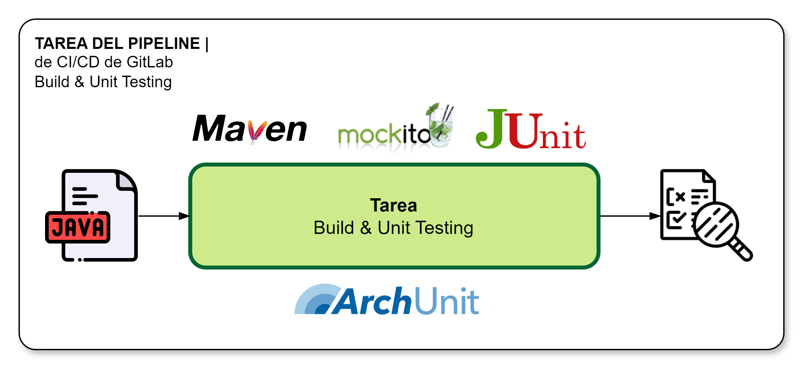

[[_TOC_]]

# Información General

|Propiedad|Descripción|
|-|-|
|**Nombre**|Build and Unit Testing|
|**Propósito**|Verificar que los diferentes componentes del microservicios cumplen los requerimientos establecidos a través de pruebas unitarias (caja negra)|
|**Disparador**|Merge Request|
|**Container**|comsatel/maven-cli:3.8.1-openjdk-15-slim|

# Diagrama General

# Variables
Las variables disponibles para personalizar el comportamiento de la tarea incluyen a las siguientes:

> No aplica

# Resultados

¿Qué sucede cuando se realiza la ejecución de la tarea?

1. Se verifica que el componente software es compilable.s
2. Se verifica unitariamente el código (JUnit)
3. Se verifica cumplimiento de la arquietctura (arcunit)
4. Se emular dependencias externas al microservicios.

# Implementación

La implementación de esta tarea se encuentra definida según se indica a continuación:

1. La implementación de encuentra en [Proyecto CI-CD](https://project.comsatel.com.pe/comsatel/infrastructure/ci-cd/-/blob/develop/maven-build.yml).
