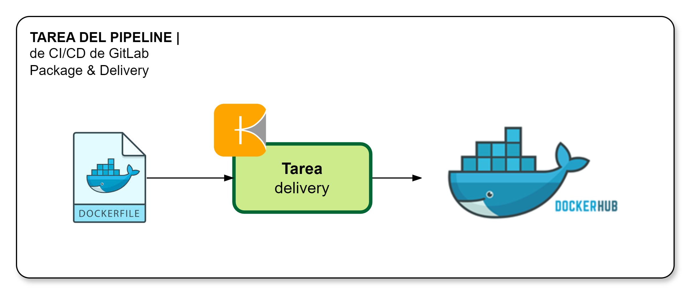

[[_TOC_]]

# Información General

|Propiedad|Descripción|
|-|-|
|**Nombre**|Package & Delivery|
|**Propósito**|Empaquetar el microservicio en imagen de contenedor y su publicación en repositorio de imagenes de contenedores|
|**Disparador**|Merge Request|
|**Container**|`comsatel/kaniko-executor:debug`|

# Diagrama General

# Variables
Las variables disponibles para personalizar el comportamiento de la tarea incluyen a las siguientes:

|Variable|Descripción|Valor implícito|
|-|-|-|
|DOCKERFILE|Nombre del archivo Dockerfile|Dockerfile|
|DOCKERHUB_USERNAME|Nombre del usuario de cuenta en Docker Hub||
|DOCKERHUB_PWD|Contraseña del usuario||

# Resultados

¿Qué sucede cuando se realiza la ejecución de la tarea?

1. Se realiza el empaquetado de la imagen de contedor y su pliegue usando Helm Chart del componente (microservicio o aplicación Web) en entorno DEV si se ha realizado un `Merge Request` sobre rama `Feature`.
2. Se obtiene el número para el tag de la imagen a partir de versión en `pom.xml` o `package.json`
3. Se etiqueta la imagen generada con `IMAGE_VERSION`-`dev`, `IMAGE_VERSION`-`qa`, `IMAGE_VERSION`-`pre`, `IMAGE_VERSION`-`prod` y `IMAGE_VERSION`-`latest`
4. Se publica la imagen en repositorio de imagenes en `Docker Hub`

# Implementación

La implementación de esta tarea se encuentra definida según se indica a continuación:

1. La implementación de encuentra en [Proyecto CI-CD](https://project.comsatel.com.pe/comsatel/infrastructure/ci-cd/-/blob/develop/image-registry.yml) para microservicios.
2. La implementación de encuentra en [Proyecto CI-CD](https://project.comsatel.com.pe/comsatel/infrastructure/ci-cd/-/blob/develop/image-registry_web.yml) para aplicaciones web.
3. La parametría de variables de la tarea se ubican en [Variables OCI OKE - Kubernetes](https://project.comsatel.com.pe/groups/comsatel/development/-/settings/ci_cd)