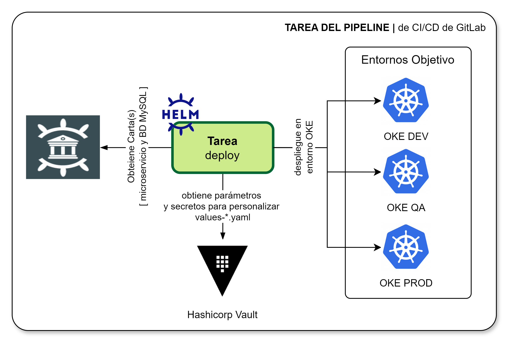

[[_TOC_]]

# Información General

|Propiedad|Descripción|
|-|-|
|**Nombre**|Deploy|
|**Propósito**|Realizar el despliegue de los componentes software en el entorno objetivo (DEV, QA, PRE, PROD)|
|**Disparador**|Merge Request|
|**Container**|`comsatel/oke-cli-tools:0.1.0`|

# Diagrama General

# Variables
Las variables disponibles para personalizar el comportamiento de la tarea incluyen a las siguientes:

|Variable|Descripción|Valor implícito|
|-|-|-|
|NAMESPACE|Nombre del `namespace` de OKE donde se depliega el componente|microservices|
|NAMESPACE_POSTFIX|Posfijo adicional para separar namespace por uso (nota: uso futuro)|""|
|DEPLOYMENT_NAME|Nombre del deployment (se especifica en .gitlab-ci.yml)|"changeme"|
|CUSTOMIZATION_VALUES|Nombre del archivo de valores por default|"values.yaml"|
|IMAGE_TAG|Identificacion del numero de version de imagen. Se recalcula de forma automática|$CI_COMMIT_SHORT_SHA|
|CHART_PATH|Ruta donde se ubica localmente la carta Helm|"./chart"|
|ENV|Nombre del entorno objetivo. Se recalcula según las ramas sobre las que se realiza el `Merge Request`|"dev"|
|VAULT_ADDR|Ruta de repositorio de parametría Hashicorp Vault desde donde se obtiene parametría inyectadas como variables de entorno|"https://vault.dev.comsatel.com.pe/"|
|DEPLOY_TIMEOUT|Tiempo máximo de espera a que CLI helm realice el despliegue para declarar éxito o falla del despliegue|"10m0s"|
|DBREQUIRED|Se requiere generar automáticamente la BD del componentes. Se crea una BD MySQL.|"yes"|
|DOCKERFILE|Ruta donde ubicar el archivo para generación automática de la imagen del contenedor desde donde se extrae información de versión del contenedor|Dockerfile|

> Los archivos de valores deben estar definidos y seguir la convención `values-ENTORNO.yaml` donde ENTORNO es dev, qa, pre, prod.

# Resultados

¿Qué sucede cuando se realiza la ejecución de la tarea?

1. Se realiza el despliegue usando Helm Chart del componente (microservicio o aplicación Web) en entorno DEV si se ha realizado un `Merge Request` sobre rama `Feature`.
2. Se realiza el despliegue usando Helm Chart del componente (microservicio o aplicación Web) en entorno QA si se ha realizado un `Merge Request` sobre rama `develop`.
3. Se realiza el despliegue usando Helm Chart del componente (microservicio o aplicación Web) en entorno CERT si se ha realizado un `Merge Request` sobre rama `certification`.
4. Se realiza el despliegue usando Helm Chart del componente (microservicio o aplicación Web) en entorno PROD si se ha realizado un `Merge Request` sobre rama `master`.
5. Si se tiene la variable `DBREQUIRED` con `True` se detecta si ya se tiene una Base de Datos MySQL generada, si aún no se creado se realiza la creación de la BD usando [Carta HELM de MySQL](https://chartmuseum.dev.comsatel.com.pe) - [Chartmuseum Portal](https://chartmuseum-ui.dev.comsatel.com.pe/)

# Implementación

La implementación de esta tarea se encuentra definida según se indica a continuación:

1. La implementación de encuentra en [Proyecto CI-CD](https://project.comsatel.com.pe/comsatel/infrastructure/ci-cd/-/blob/develop/deploy-kubernetes.yaml) para microservicios.
2. La implementación de encuentra en [Proyecto CI-CD](https://project.comsatel.com.pe/comsatel/infrastructure/ci-cd/-/blob/develop/deploy-kubernetes-web.yaml) para componentes web.
1. La parametría de variables de la tarea se ubican en [Variables OCI OKE - Kubernetes](https://project.comsatel.com.pe/groups/comsatel/development/-/settings/ci_cd)