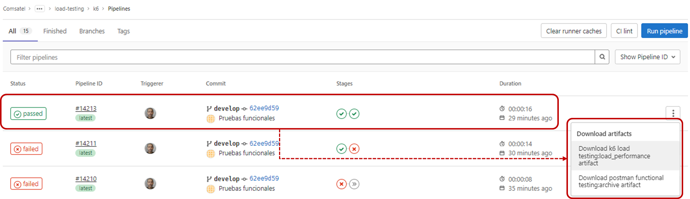

[[_TOC_]]

# Información General

|Propiedad|Descripción|
|-|-|
|**Nombre**|Funcional Testing|
|**Propósito**|Verificar que los requerimientos funcionales definidos se encuentren debidamente cubiertos por la solución (DEV, QA, PRE)|
|**Disparador**|Merge Request|
|**Herramientas**|Postman|
|**Container**|`comsatel/newman:0.1.0`|

# Diagrama General

# Variables
Las variables disponibles para personalizar el comportamiento de la tarea incluyen a las siguientes:

|Variable|Descripción|Valor implícito|
|-|-|-|
|POSTMAN_COLLECTION|Nombre del archivo en `test/functional` del archivo de automatización de las pruebas|Test.postman_collection.json|
|POSTMAN_ENABLED|Activa/desactiva la ejecución de las pruebas automatizadas funcionales (API Restfull)|false|
|BREAK_ON_POSTMAN_FAILED|Indica si el pipeline quiebra por al menos un caso de prueba fallido|false|

# Resultados

¿Qué sucede cuando se realiza la ejecución de la tarea?

1. Si el microservicio tiene seguridad, se debe obtener el token JWT para consumo seguro del microservicio usando integración con `RedHat Keycloak`.
2. Se realiza la ejecución de los diferentes casos de pruebas funcionales (según la organización definda de funcionalidades y casos de prueba).
3. Finalizada la ejecución de todos los casos de pruebas se generan las evidencias de los resultados obtenidos (éxitos o fallas).
4. Las evidencias de las pruebas quedan registradas en la ejecución del pipeline en GitLab.
5. Si se producen fallas (y se tiene activa `BREAK_ON_POSTMAN_FAILED`) el `pipeline` finaliza con falla y se debe realizar las acciones de levantamiento de dichas fallas.

Una vez finalizada la ejecución se puede observar en el pipeline el resultado.

# Implementación

La implementación de esta tarea se encuentra definida según se indica a continuación:

1. La implementación de encuentra en [Proyecto CI-CD](https://project.comsatel.com.pe/-/ide/project/comsatel/infrastructure/ci-cd/tree/develop/-/postman-testing.yaml) para microservicios.
2. La implementación de los casos de pruebas se deben encontrar en `test/functional/postman`

# Referencias

1. N/A