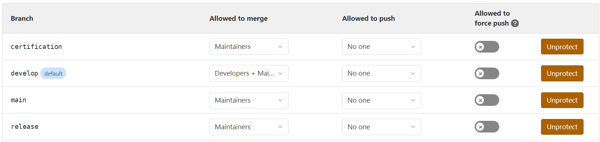
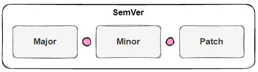
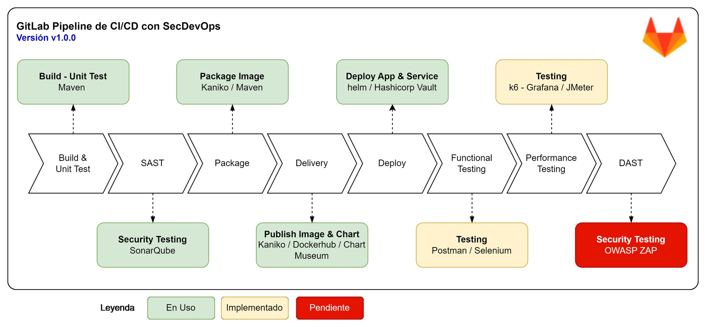
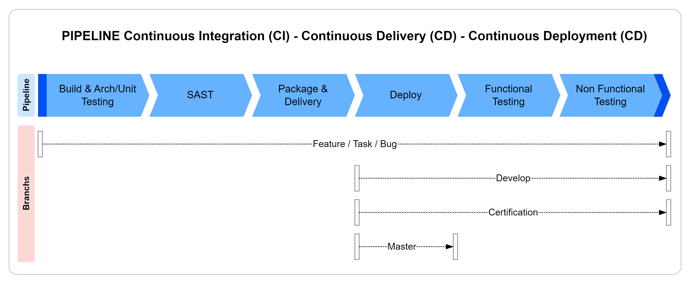
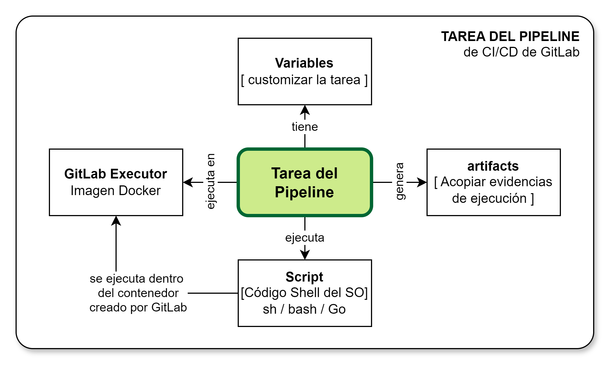

[[_TOC_]]

# Gestión de Configuración

## Ramas
### Definición de Ramas

| Rama | Propósito | Anotaciones |
|------|-----------|-------------|
| master / main | Espacio que contiene las fuentes debidamente congeladas (etiquetadas) y liberadas en el entorno productivo. **Genera despliegue en ambiente PROD.** | Sirve como punto de referencia de la versión oficial del SWCI. Recibe los cambios desde ramas `release` |
| release | Espacio que contiene los cambios a los SWCI previos a la salida a producción. **Actualmente no cuenta con ambiente, por lo que no despliega.** | Recibe las contribuciones de la rama de `certificacion` o desde las ramas `X_Bugfix_Y` o `X_Hotfix_Y`. |
| certification | Espacio que contiene los cambios a los SWCI para las pruebas de calidad final. **Genera despliegue en ambiente QA.** | Recibe los cambios publicados desde rama `develop`. |
| develop | Espacio para la integración de los cambios realizados durante la ejecución de las tareas planificadas. **Genera despliegue en ambiente DEV.** | Recibe los cambios publicados en producción luego de un pase de bug o hot fixing. |
| X_Feature_Y | Contiene e integra los cambios para todo el conjunto de tareas definidas en el Sprint Planning. **No despliega, debe ser estrictamente una rama de integración** (buscando evitar múltiples despliegues cuando varios equipos hacen push simultáneo). | Se crea a partir de la actual versión en producción desde la rama `master`. Integra todos los cambios que se producen durante la ejecución del Sprint `Y` para el alcance `X`. Se debe asegurar que la versión referenciada en cada SWCI afectado por el Sprint se les incremente el valor de MAJOR o MINOR según corresponde y siguiente las reglas de incremento de la versión definido en sección `Esquema de Versionado`. |
| X_Hotfix_Y | Contiene e integra los cambios que se realizan en atención a resolución de `defectos` (con `SLA ALTO`) sobre uno o varios SWCI. | Se crea a partir de la actual versión en producción desde la rama `master`. Integra todos los cambios que se producen durante la ejecución del conjunto de bugs `X`. Se debe asegurar que la versión referenciada en cada SWCI afectado por los bugs se les incremente el valor de PATCH en la unidad "1". |
| X_Bugfix_Y | Contiene e integra los cambios que se realizan en atención a resolución de `defectos` (con `SLA MEDIO / BAJO`) sobre uno o varios SWCI. | Se crea a partir de la actual versión en producción desde la rama `master`. Integra todos los cambios que se producen durante la ejecución del conjunto de bugs `X`. Se debe asegurar que la versión referenciada en cada SWCI afectado por los bugs se les incremente el valor de PATCH en la unidad "1". |

### Seguridad de Ramas

> Las ramas se encuentran protegidas sobre operaciones posibles de acuerdo con los roles de los usuarios de GitLab. El esquema de protección definido es el siguiente.

### Rama implícita de trabajo

> De todas las ramas, `develop` se establece siempre como la rama default. Esta condición hace que GitLab intente utilizar dicha rama como la default para diferentes operaciones, por ejemplo, una operación de `git clone` si no se especifica la rama, entonces asume que esta será `develop`

## Esquema de Versionado

El esquema de versionado de los Elementos de Configuración de Software (SWCI) se realiza siguiendo las buenas prácticas documentadas en [Semantic Versioning 2.0.0](https://semver.org)

El propósito de cada componente del número de versión tiene el siguiente significado:

1. **MAJOR** representa el número principal de versión de un Elemento de Configuración del Software (SWCI - Software Configuration Item) y sufre un cambio (incrementado en la unidad "1") cuando se produce un cambio de la arquitectura y/o el cambio genera cambios incompatibles al nivel del API de un servicio o aplicación. Cuando se produce un cambio de este número de la versión tanto el valor de MINOR como PATCH deben ser forzados al valor "0".
2. **MINOR** representa el número menor de la versión de un Elemento de Configuración del Software (SWCI - Software Configuration Item) y sufre cambio cuando se añade una nueva característica al SWCI o se modifica una característica presente en el SWCI. Cuando se produce un cambio de este número de la versión se debe forzar el PATCH al valor "0". Se preserva completamente la compatibilidad con versión previa.
3. **PATCH** representa el número de la versión asociado con la resolución de defectos manifestados en forma de bug. Se preserva completamente la compatibilidad con versión previa.

## Flujo para Sprint (User Stories)

1. El SCRUM Master deberá generar la rama `D_Feature_#` correspondiente al `Sprint #` del `Proyecto del Alcance D` desde la versión actual de la rama master.
2. El SCRUM Master deberá actualizar el número de versión (pom.xml) con la nueva versión objetivo (nota: esto es crítico para asegurar correcto etiquetado de librerias e imagen de contenedor Docker)
3. Los miembros del SCRUM Team deberán crear sus ramas de trabajo propias para el trabajo dentro del Sprint. El nombre de estas ramas debiera seguir el formato `D_Task_#` correspondiente a la `Tarea #` del `Proyecto del Alcance D`. Considerando que en GitLab los issues para las tareas tienen ID único global, el valor de # se puede tomar como el ID del Issue de la tarea. Adicionalmente, se puede crear las ramas a partir del nombre del `login en GitLab` del desarrollador. Esta rama es eliminada una vez que el desarrollador integra sus cambios de forma satisfactoria sobre la rama `D_Feature_#` correspondiente. **NOTA: La rama Feature no genera despliegue, es estrictamente una rama de integración.**
4. Para visualizar, probar o integrar con otros equipos los cambios en desarrollo, el conjunto de tareas se integran hacia la `rama develop`, la cual **despliega automáticamente en el ambiente DEV**.
   > **⚠️ IMPORTANTE - PREVENCIÓN DE CONFLICTOS DE FLYWAY:** Dado que la arquitectura se orienta a DDD (cada microservicio tiene su propia base de datos), la integración simultánea de múltiples equipos hacia la rama `develop` puede causar conflictos de versionado en las migraciones de base de datos. **Antes de realizar la integración a `develop`**, el desarrollador debe verificar obligatoriamente cuál es la última versión del script de Flyway aplicada en la base de datos del entorno DEV para su microservicio, y ajustar correspondientemente la numeración de los nuevos scripts para evitar fallos durante el despliegue automático.
5. Una vez que las tareas de la Historia de Usuario son completadas, validadas en DEV y satisfagan con evidencias los `Criterios de Aceptación` o `Condición de Hecho`, se promueven a la rama `certification`, la cual **despliega automáticamente en el ambiente QA**. Quedando expedito para las pruebas formales por parte del Analista de Calidad.
6. Finalmente, una vez superadas las pruebas en QA, se procede con promover los cambios hacia la rama `release` (si es requerido para flujos de pre-paso, recordando que **no tiene ambiente ni genera despliegue**) y seguidamente a la `rama master` o `main`, realizando con ello el correspondiente pase al entorno **productivo (PROD)**.
7. El SCRUM Master debe asegurar los alineamientos de las ramas.

## Flujo para Bug/Hot fixing (Bugs)

1. El SCRUM Master deberá generar la rama `D_Hotfix_#` o `D_Bugfix` donde se resuelven los defectos del producto que producen los bugs reportados por los usuarios desde la versión actual de la rama master.
2. A todos los SWCI afectados por los cambios se les deberá asignar el número de versión "conforme a SemVer" que corresponde a una versión PATCH.
3. Los miembros del SCRUM Team deberán crear sus ramas de trabajo propias para el trabajo dentro del Sprint. El nombre de estas ramas debiera seguir el formato `D_BugFix_#` correspondiente a la `Bug #` del `Paquete de Bugs D`. Considerando que en GitLab los issues para los bugs tienen un ID único global, el valor de # se puede tomar como el ID del Issue del bug. Adicionalmente, se puede crear las ramas a partir del nombre del `login en GitLab` del desarrollador. Esta rama es eliminada una vez que el desarrollador integra sus cambios de forma satisfactoria sobre la rama `D_Bugfix_#` o `D_Hotfix_#` correspondiente. Los cambios publicados en esta rama son desplegados automáticamente en entorno de desarrollo.
4. Una vez que todos los bugs del alcance sean resueltos y probados de forma unitaria y satisfagan con evidencias los `Criterios de Aceptación` o `Condición de Hecho` de la funcionalidad afectada por el bug, todo el conjunto de cambios puede ser integrado en la `rama release`. 
5. Finalmente, se procede con promover los cambios hacia la `rama master` realizando con ello el correspondiente pase al entorno **productivo**.
6. El SCRUM Master debe asegurar los alineamientos de las ramas.

## Pipeline CI/CD

Las tareas del pipeline se basan en pequeños bloques construidos para cubrir las necesidades de todo un pipeline de CI/CD de gitlab. 

|Tarea|Propósito|Herramientas|Entorno|
|-|-|-|-|
|[Build](gestion-configuracion/build)|Aseguar que el código es compilable|Maven|Dev|
|[Architecture Testing](gestion-configuracion/build)|Asegurar cumplimiento del diseño de arquitectura|Maven|Dev|
|[Unit Testing](gestion-configuracion/build)|Asegurar cumplimiento del objetivo de calidad al nivel unitario|Maven|Dev|
|[SAST](gestion-configuracion/sast)|Análisis estático de código seguro|Maven - SonarQube|Dev,QA|
|[Package](gestion-configuracion/package)|Empaquetar la unidad en imagen de contenedor|Maven - Docker|Dev|
|[Delivery](gestion-configuracion/delivery)|Distribuir la unidad de despliegue a repositorio de artefactos|Docker Hub|Dev|
|[Deploy](gestion-configuracion/deploy)|Desplegar el SCI en el entorno no productivo o producto|Kubectl - OKE|Dev, QA, Pre, Prod|
|[Functional Testing](gestion-configuracion/functional-testing)|Asegurar cumplimiento del objetivo de calidad del SCI|Selenium - Postman|Dev, QA, Pre|
|[Load Testing](gestion-configuracion/load-testing)|Asegurar cumplimiento de requerimientos de carga|k6|Dev, QA, Pre|
|[Vulnerabilidades en Contenedor](gestion-configuracion/vulnerabilidad-contenedor)|Detección de vulnerabilidades en imágenes de contenedores|trivy|