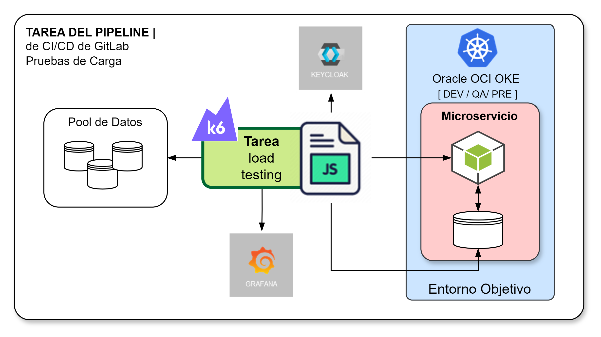
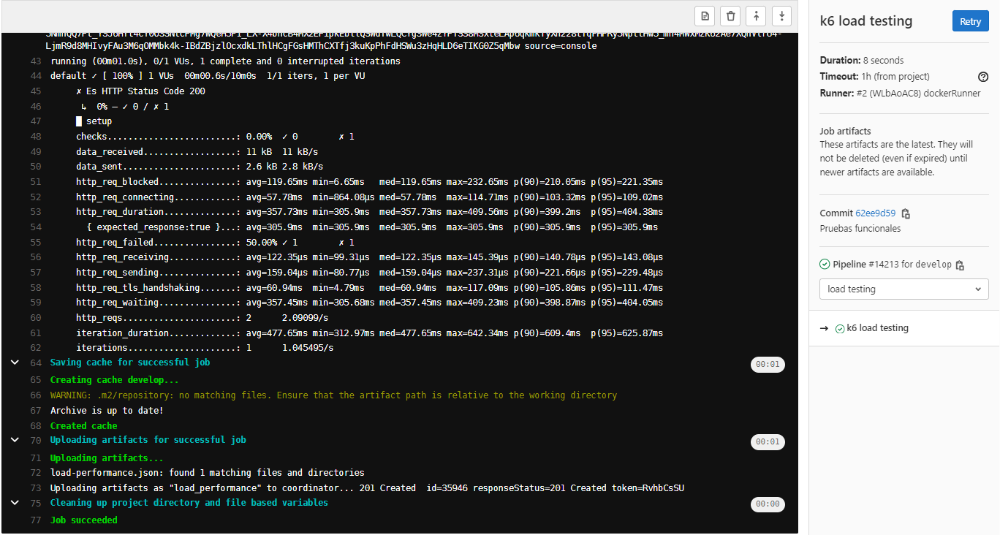

[[_TOC_]]

# Información General

|Propiedad|Descripción|
|-|-|
|**Nombre**|Load Testing|
|**Propósito**|Verificar que los requerimientos de cargas definidos se encuentren debidamente cubiertos por la solución (DEV, QA, PRE)|
|**Disparador**|Merge Request|
|**Herramientas**|Grafana k6|
|**Container**|`loadimpact/k6:0.39.0`|

# Diagrama General

# Variables
Las variables disponibles para personalizar el comportamiento de la tarea incluyen a las siguientes:

|Variable|Descripción|Valor implícito|
|-|-|-|
|PROMETHEUS_INTEGRATION|Indicador de integración de métricas en Prometheus|false|
|K6_OPTIONS|Parámetros adicionales que se requieran para personalizar la ejecución k6|""|
|K6_PROMETHEUS_RW_SERVER_URL|URL de Prometheus para registro de métricas de las pruebas|""|
|K6_PROMETHEUS_RW_USERNAME|Usuario de acceso a registro de métricas en prometheus|""|
|K6_PROMETHEUS_RW_PASSWORD|Contraseña del usuario|""|

# Resultados

¿Qué sucede cuando se realiza la ejecución de la tarea?

1. Si el microservicio tiene seguridad, se debe obtener el token JWT para consumo seguro del microservicio usando integración con `RedHat Keycloak`.
2. Se realiza la ejecución de los diferentes casos de pruebas de carga implementados en Grafana k6.
3. Finalizada la ejecución de todos los casos de pruebas se generan las evidencias de los resultados obtenidos (éxitos o fallas). Las evidencias de las pruebas quedan registradas en la ejecución del pipeline en GitLab.
4. Si se producen fallas el `pipeline` finaliza con falla y se debe realizar las acciones de levantamiento de dichas fallas.
5. Los resultados de las pruebas se almacenan en Plataforma Grafana para su análisis.

Una vez finalizada la ejecución se puede observar en e pipeline el resultado.

El detalle de la ejecución de la tarea `Prueba de Carga k6` se puede ver en la siguiente imagen

# Implementación

La implementación de esta tarea se encuentra definida según se indica a continuación:

1. La implementación de encuentra en [Proyecto CI-CD](https://project.comsatel.com.pe/comsatel/infrastructure/ci-cd/-/blob/develop/k6loadtesting.yaml) para microservicios.
2. La implementación de los casos de pruebas se deben encontrar en `test/load/k6.js`

# Referencias

1. [k6 con Grafana](https://grafana.com/docs/k6/latest/get-started/running-k6/)