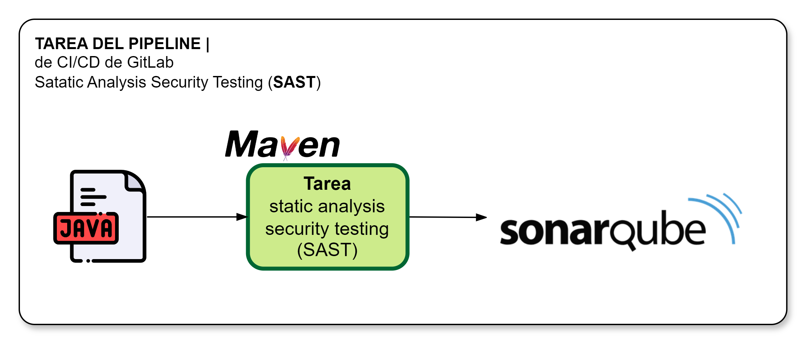

[[_TOC_]]

# Información General

|Propiedad|Descripción|
|-|-|
|**Nombre**|Static Security Analysis Testing (SAST)|
|**Propósito**|Verificar que el código desarrollo es seguro y cumple con el perfil de calidad establecido|
|**Disparador**|Merge Request|
|**Container**|comsatel/maven:3.9.6-amazoncorretto-17|

# Diagrama General

# Variables
Las variables disponibles para personalizar el comportamiento de la tarea incluyen a las siguientes:

|Variable|Descripción|Valor implícito|
|-|-|-|
|**SONAR_HOST_DNS**|URL del Servidor SonarQube|sonarqube.qa.comsatel.com.pe|
|**SONAR_LOGIN**|Usuario de SonarQube|admin|
|**SONAR_PASSWORD**|Password de SonarQube||

# Resultados

¿Qué sucede cuando se realiza la ejecución de la tarea?

1. Se analiza el código contra el estándar de programación según el lenguaje (Java, JavaScript, Python)
2. Se determinan métricas de calidad del código y contrastan contra los valores del perfil de calidad (Quality Gate COMSATEL)
3. Se analiza métricas relacionadas a vulnerabilidades `Top 10 OWASP`
4. Se analiza métricas relacionadas a vulnerabilidades `CVE`
5. El no cumplimiento del [Perfil de Calidad (Quality Gate](validacion-verificacion/perfil-calidad-sonarqube) produce la falla de la tarea y el quiebre del pipeline (Nota: es responsabilidad inmediata del Equipo SCRUM devolver el pipeline al estado de ejecución exitosa).
6. Los resultados quedan registrados en [Plataforma SonarQube](https://sonarqube.qa.comsatel.com.pe)

# Implementación

La implementación de esta tarea se encuentra definida según se indica a continuación:

1. La parametría de variables de la tarea se ubican en [Variables SONARQube](https://project.comsatel.com.pe/groups/comsatel/development/products/-/settings/ci_cd)