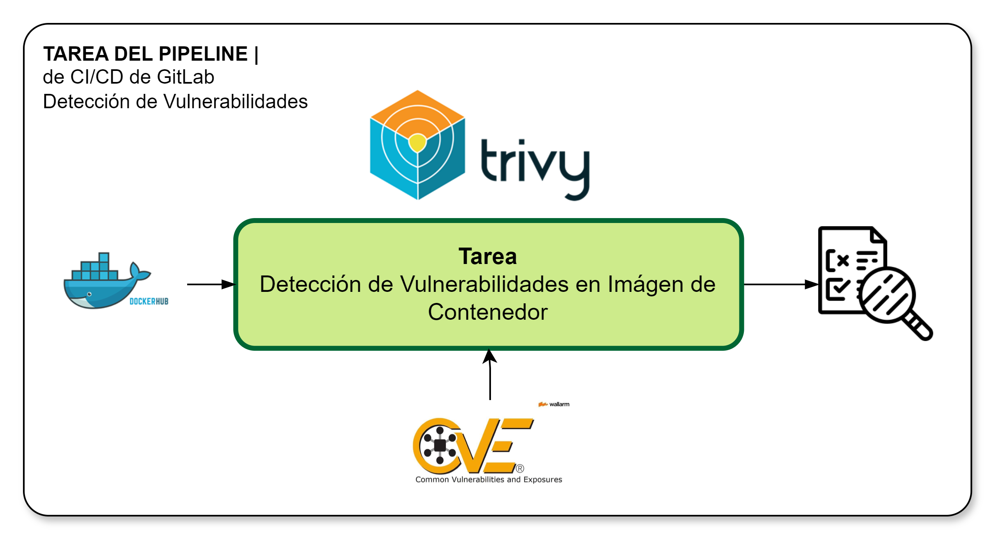

[[_TOC_]]

# Información General

|Propiedad|Descripción|
|-|-|
|**Nombre**|Detección de Vulnerabilidades|
|**Propósito**|Evaluar las vulnerabilidades presentes en las imagenes de contenedores de los microservicios|
|**Disparador**|Merge Request|
|**Container**|docker:stable|

# Diagrama General

# Variables
Las variables disponibles para personalizar el comportamiento de la tarea incluyen a las siguientes:

|Variable|Descripcion|Valor|
|-|-|-|
|ENABLE_TRIVY|Habilita aplicar chequeo de vulnerabilidad|true|
|DOCKERIMAGE|Nombre de la imagen de contenedor|(default: definida en pipeline específicos)|

> El valor de DOCKERIMAGE se define automáticamente por el arquetipoo y se declara en .gitlab-ci.yml

# Resultados

¿Qué sucede cuando se realiza la ejecución de la tarea?

1. Se verifica la imagen contra la base de datos de vulnerabilidades [CEV - Common Vulnerabilities and Exposures](https://cve.mitre.org/index.html)
2. Se verifica el perfil de calidad según nivel de vulnerabilidad y se quiebra el pipeline ante incumplimiento del perfil (CVE Críticas)
3. Se genera un reporte con los hallazgos y se adjunto a la ejecución del pipeline.

# Implementación

La implementación de esta tarea se encuentra definida según se indica a continuación:

1. La implementación de encuentra en [Proyecto CI-CD](https://project.comsatel.com.pe/comsatel/infrastructure/ci-cd/-/blob/develop/trivy.yml).

# Referencias

1. [Trivy](https://trivy.dev/)
2. [Artículo de Escaneo de Vulnerabilidades con Trivy](https://www.bluetab.net/en/container-vulnerability-scanning-with-trivy/?gad_source=1&gclid=Cj0KCQjw_qexBhCoARIsAFgBlescQlE9NyrXNJ9wTjc3NWCTbF0rBWQs0kqni6O3OsXW1xicWoE-cuAaAu8KEALw_wcB)