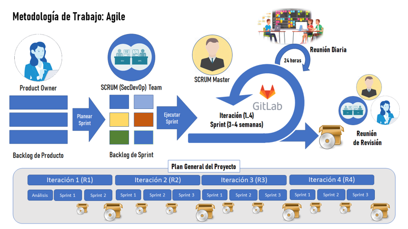
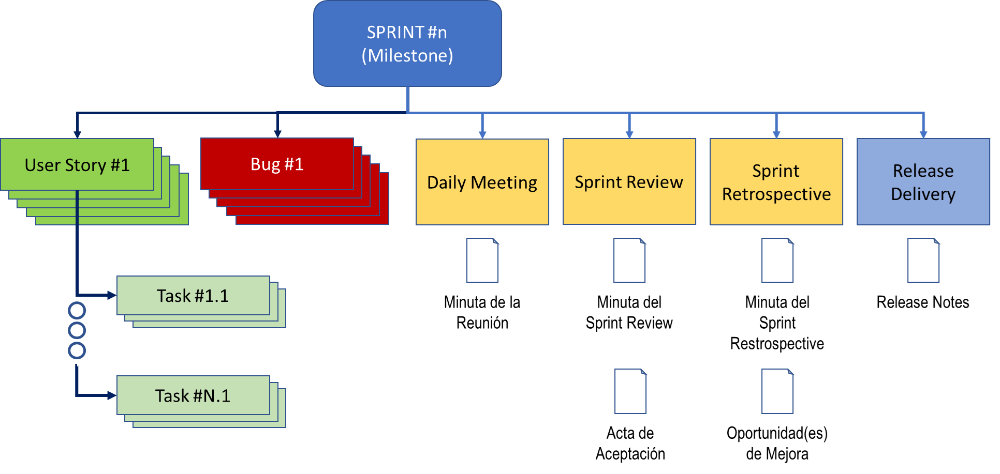

Metodologia de Desarrollo y Mantenimiento de Software

- [Introducción](#introducción)
  - [Nuestros compromisos dentro del marco metodológico](#nuestros-compromisos-dentro-del-marco-metodológico)
  - [Composición del Sprint](#composición-del-sprint)
- [Actividades Claves](#actividades-claves)
  - [Ceremonias SCRUM](#ceremonias-scrum)
  - [Actividades Específicas](#actividades-específicas)
- [Roles](#roles)
- [Productos de Trabajo](#productos-de-trabajo)
- [Soporte Tecnológico](#soporte-tecnológico)
- [Código de Conducta](#código-de-conducta)

# Introducción

El framework SCRUM se base en 5 eventos claves y tres pilares fundamentales de un proceso que en esencia es un `proceso empírico`. Los pilares principales son:

1. _Transparencia_: _de los tres artefactos_ Backlog del Producto, Sprint Backlog e Incremento del Producto, sobre los acuerdos, las formas de colaboración (interna y externa) y como el incremento del producto contribuye a la visión y estrategia de la organización.

> Todos conocemos lo que está sucediendo en el sprint.

1. _Inspección_: del progreso a través el objetivo del producto y del objetivo del sprint comprometido.

> Chequear el trabajo en la medida que este se realiza.

1. _Adaptación_: decidir las acciones necesarias y su ejecución para cubrir las necesidades de adaptación del incremento del producto o del desarrollo.

> Se ajusta la dirección del trabajo para alcanzar el objetivo del sprint.

## Nuestros compromisos dentro del marco metodológico

* **Definición de "Hecho"**: Cuando un incremento es entregado, este debe corresponder con un entendimiento y compromiso común entre todos los interesados sobre qué significa "Hecho". Esta definición de hecho asegura que se alcance el estándar de calidad definido.
* **Sprint Goal**: Un propósito específico y singular del backlog del Sprint. El objetivo ayuda a que cada uno se enfoque en lo que se requiere se realice y por qué es requerido.
* **Product Goal**: Para planificar el trabajo de cada sprint, el equipo SCRUM necesidad una idea clara del objetivo del producto a través de su ciclo de vida.

## Composición del Sprint

La composición de cada uno de los Sprints del producto se estructura a partir del Backlog del Sprint de la siguiente forma.

# Actividades Claves

## Ceremonias SCRUM
* [Project Planning](ceremonias-scrum/project-planning)
* [Daily Meeting](ceremonias-scrum/daily-meetings)
* [Sprint Planning](ceremonias-scrum/sprint-planning)
* [Sprint Review](ceremonias-scrum/sprint-review)
* [Sprint Retrospective](ceremonias-scrum/sprint-retrospective)

## Actividades Específicas
* [Reunión Diaria de Líderes](reunion-diaria-lideres)
* [Reunión Semanal de Líderes - Retrospectiva Semanal](reunion-semanal-lideres)
* [Desarrollo de Alcances](requerimientos/README)
* [Desarrollo de Microservicios](arquitectura/ciclo-vida-microservicios)
* [Validacion y Verificacion](validacion-verificacion/home)
* [Gestión de Configuración - SCM](gestion-configuracion/gesti%C3%B3n-de-configuraci%C3%B3n)
* [Seguridad de Solución](seguridad/modelo-seguridad)

# Roles

* [SCRUM Master](roles/role-scrum-master)
* [Product Owner](roles/role-product-owner)
* [Arquitecto de Soluciones](roles/role-arquitecto-soluciones)
* [Analista Funcional](roles/role-analista-funcional)
* [Analista BI](roles/role-analista-bi)
* [Team Member: Developer](roles/role-team-member-dev)
* [Team Member: QA](roles/role-team-member-qa)
* [Team Member: Ops](roles/role-team-member-ops)

Cada uno de los roles del Team Member tiene un Perfil por Competencias definido:

1. [Analista Funcional Junior](https://superset.dev.comsatel.com.pe/superset/dashboard/5/?native_filters_key=qUQdrudJA4eoIAASaoBRMn2UnwmJcvkIGtj2vO_QkNuOf6dQJTiFo-LUy-CmSd2M)
2. [Analista Funcional Senior](https://superset.dev.comsatel.com.pe/superset/dashboard/5/?native_filters_key=qUQdrudJA4eoIAASaoBRMn2UnwmJcvkIGtj2vO_QkNuOf6dQJTiFo-LUy-CmSd2M)
3. [Arquitecto de Soluciones](https://superset.dev.comsatel.com.pe/superset/dashboard/5/?native_filters_key=qUQdrudJA4eoIAASaoBRMn2UnwmJcvkIGtj2vO_QkNuOf6dQJTiFo-LUy-CmSd2M)
4. [Analista de Datos - BI](https://superset.dev.comsatel.com.pe/superset/dashboard/5/?native_filters_key=qUQdrudJA4eoIAASaoBRMn2UnwmJcvkIGtj2vO_QkNuOf6dQJTiFo-LUy-CmSd2M)
5. [Developer Junior](https://superset.dev.comsatel.com.pe/superset/dashboard/5/?native_filters_key=qUQdrudJA4eoIAASaoBRMn2UnwmJcvkIGtj2vO_QkNuOf6dQJTiFo-LUy-CmSd2M)
6. [Developer Senior](https://superset.dev.comsatel.com.pe/superset/dashboard/5/?native_filters_key=qUQdrudJA4eoIAASaoBRMn2UnwmJcvkIGtj2vO_QkNuOf6dQJTiFo-LUy-CmSd2M)
7. [Analista de Calidad Junior](https://superset.dev.comsatel.com.pe/superset/dashboard/5/?native_filters_key=qUQdrudJA4eoIAASaoBRMn2UnwmJcvkIGtj2vO_QkNuOf6dQJTiFo-LUy-CmSd2M)
8. [Analista de Calidad Senior](https://superset.dev.comsatel.com.pe/superset/dashboard/5/?native_filters_key=qUQdrudJA4eoIAASaoBRMn2UnwmJcvkIGtj2vO_QkNuOf6dQJTiFo-LUy-CmSd2M)

# Productos de Trabajo
| Nombre | Breve resumen (Propósito) | Referencia |
|--------|---------------------------|------------|
| [Documento de Alcance](workproducts/documento-alcance) | Permite especificar los requerimientos del cliente |  |
| [Costeo del Alcance](workproducts/costeo-alcance) | Resumen de la estimación de tiempos y costos del alcance |  |
|Especificacion de Epica|Especificación de las épicas enmarcando el alcance de un conjunto de historias de usuario||
| [Minuta Sprint Review](https://project.comsatel.com.pe/comsatel/development/components/cross-collaboration/-/blob/main/.gitlab/issue_templates/sprint-review.md) | Contiene el contenido y resultados de la ejecución del Sprint Review |  |
| [Minuta Sprint Retrospective](https://project.comsatel.com.pe/comsatel/development/components/cross-collaboration/-/blob/main/.gitlab/issue_templates/sprint-retrospective.md) | Cubre el resultado de la ejecución del Sprint Retrospective como última actividad que finaliza el Sprint |  |
| [Nota al Release](https://project.comsatel.com.pe/comsatel/development/components/cross-collaboration/-/blob/main/.gitlab/issue_templates/release-note.md) | Resumen de notas al release |  |
| [Minuta de Reunión](https://project.comsatel.com.pe/comsatel/development/components/cross-collaboration/-/blob/main/.gitlab/issue_templates/Meeting.md) | Minuta de Reunión de trabajo |  |
| [Architectural Decision Record - ADR](workproducts/architecture-decision-record) | Permite documentar las decisiones técnicas que se realizan en el producto con impacto sobre la arquitectura de la solución ||
| [Documentación de Vista de Arquitectura](workproducts/architecture-view) | Plantilla para elaboración de la documentación técnica de la arquitectura del producto y los componentes | |
| Modelo Estructura Lógica | Capturar la especificación de la estructura lógica para la Arquitectura de Referencia (patrones de diseño) o del Producto específico | (TBD) |
| Modelo de Implementación | Capturar la especificación del Modelo de Implementación para la Arquitectura de Referencia (patrones de diseño) o del Producto específico | (TBD) |
| Modelo de Despliegue | Capturar la especificación del despliegue para la Arquitectura de Referencia (patrones de diseño) o del Producto específico | (TBD) |
| [Modelo de Seguridad](modelo-seguridad) | Capturar la especificación de la seguridad para la Arquitectura de Referencia (patrones de diseño) o del Producto específico |  |
| Modelo de Procesos | Capturar la especificación de los hilos/procesos para la Arquitectura de Referencia (patrones de diseño) o del Producto específico | (TBD) |
| Código Fuente | Código fuente del Elemento de Configuración de Software (SWCI) del Producto específico. |  |
| [Plan de Pruebas](workproducts/Plan-de-Pruebas) | Especificar el Plan de Pruebas (Malla de Pruebas) que asegure la calidad del incremento del Sprint. |  |
| [Procedimiento de Pruebas](workproducts/procedimiento-pruebas) | Especificar el Procedimiento de Prueba a Ejecutar de acuerdo con el caso de prueba |  |
| [Caso de Prueba](workproducts/Casos-de-Prueba) | Especificar el Caso de Prueba requerido para asegurar el/los Criterios de Aceptación de la Historia de Usuario | |
| [Reporte de Pruebas Automatizadas](workproducts/reporte-pruebas-automatizadas) | Presentar el Reporte de Resultados de la ejecución de los casos de pruebas, de acuerdo con la plataforma de automatización de pruebas. |  |
| [Reporte de Pruebas Manual](workproducts/reporte-pruebas) | Presentar l Reporte de Resultados de la ejecución de los casos de pruebas manuales. |  |
| [Pool de Datos de Preubas](workproducts/pool-datos-pruebas) | Especificar el conjunto de datos de pruebas requerido por el Caso de Pruebas. |  |
| Código Fuente | Código fuente el Elemento de Configuración Software (SWCI) del producto expresado a través del Repositorio Git definido. | Repositorio Git |
| Reporte Análisis Estático/Seguro | Evaluar la conformidad del Elemento de Configuración Software (SECI) con el Perfil de Calidad (Quality Gate) en base a métricas de calidad de código seguro. | SonarQube |
| [Carta Helm](workproducts/helm-chart) | Definir los "activos digitales" necesarios para el despliegue del Elemento de Configuración Software (SWCI) en el entorno objetivo (Dev, QA, Cert, Pre o Prod). | ChartMuseum |
| Configuración Parámetros | Mantener un registro centralizado de la parametría requerida por el Elemento de Configuración Software (SWCI) | HashiCorp Vault |
| Configuración Secretos | Mantener un registro centralizado y seguro de los parámetros sensibles requeridos por el Elemento de Configuración Software (SWCI) | HashiCorp Vault |
| Repositorio Git | Mantener fuentes controladas de los Elementos de Configuración Software (SWCI) | GitLab |
| Pipeline (CI/CD) | Ejecutar las diferentes tareas del ciclo completo de Integración, Delivery y Deployment continuo de los Elementos de Configuración Software (SWCI) | GitLab / OKE |
| Acta de Reunión | Registrar las reuniones realizadas entre los diferentes grupos de interés para efecto de seguimiento y control. | GitLab |
| Daily Meeting: Minuta | Mantener un registro periódico del avance diario del trabajo del Equipo SCRUM, dejando evidencias de la ejecución del Sprint. | GitLab |
| Sprint Review: Minuta | Presentar el resultado del Sprint (incremento) a los diferentes grupos de interés y recolectar retro-alimentación sobre la versión del producto a liberar según el compromiso del Sprint. | GitLab |
| Sprint Restrospective: Minuta | Identificar el desempeño alcanzado en el Sprint, identificando oportunidades para la mejora de la dinámica ágil de trabajo del equipo. | GitLab |
| Reporte Estado de Avance | Reportar el Estado del Avance semanal del proyecto de acuerdo con el Sprint Planning y el progreso realizado a la fecha de corte (lunes de cada semana) | GitLab |
| [Guia de Uso del Arquetipo Maven](guias/generacion-microservicio-con-arquetipo-maven-quarkus)|Mini Guía para el uso del arquetipo Maven para generar Microservicios usando SprintBoot||

# Soporte Tecnológico

* Tablero del Sprint - ver tablero de cada producto

1. [CLocator 2](https://project.comsatel.com.pe/comsatel/development/products/clocator2/collaboration/-/boards/34)
2. [CLocator](https://project.comsatel.com.pe/comsatel/development/products/clocator/collaboration/-/boards/73)
3. [Smart Suite](https://project.comsatel.com.pe/comsatel/development/products/smart-suite/collaboration/-/boards/56)
4. [SIGO](https://project.comsatel.com.pe/comsatel/development/products/sigo/collaboration/-/boards/63)

* [Dashboard de Tickets](https://superset.dev.comsatel.com.pe/superset/dashboard/6)
* [Dashboard de Evaluación del Desempeño de Colaboradores](https://superset.dev.comsatel.com.pe/superset/dashboard/5)

# [Código de Conducta](C%C3%B3digo-de-Conducta)