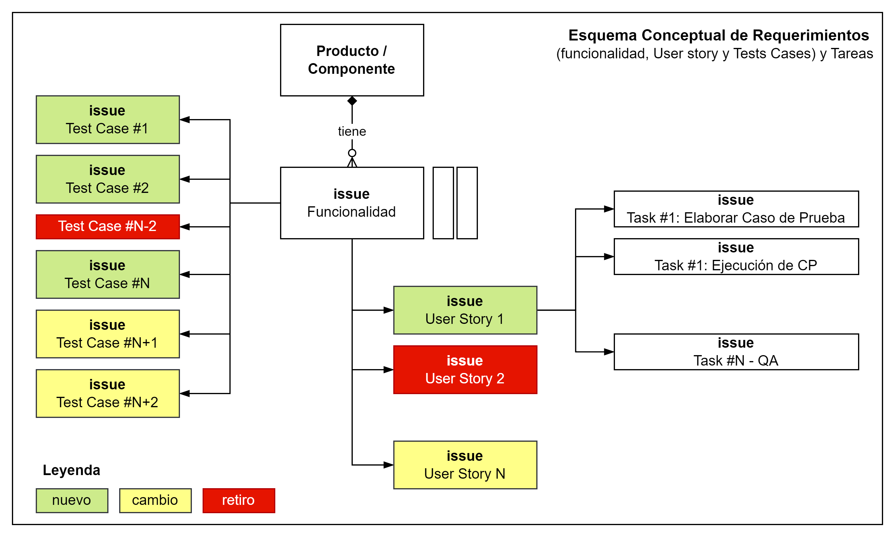

# Requerimientos de Solución

A continuación se definen los conceptos claves del modelo.

## Funcionalidad
La `funcionalidad` es la capacidad de un programa o sistema software para cumplir y proveer las funciones específicas para las que fue diseñado, satisfaciendo las necesidades (explícitas e implícitas) de los usuarios cuando es utilizado en condiciones determinadas.

En términos más sencillos, se refiere a lo que hace el software y las tareas o acciones que puede realizar para que el usuario logre sus objetivos:
- Capacidades (Features): La funcionalidad se compone del conjunto de características, herramientas y operaciones que el sistema pone a disposición del usuario. Por ejemplo, en un procesador de texto, la funcionalidad incluye la capacidad de guardar, imprimir, aplicar formato de texto, etc.
- Requisitos: Una buena funcionalidad se mide por el grado en que el software satisface los requisitos funcionales definidos en la etapa de análisis y diseño.
- Contraste con Usabilidad: Es importante notar que la funcionalidad se centra en qué hace el software, mientras que la usabilidad se centra en cómo lo hace (es decir, cuán fácil y eficiente es usar esas funciones).

# User Story
Una User Story (Historia de Usuario) es una descripción breve y simple de una funcionalidad o característica del sistema, contada desde la perspectiva del cliente final que la desea y `define el valor a ser entregado al cliente`.

Su propósito es articular cómo una pieza de trabajo proporcionará un valor particular para el cliente o usuario.

Generalmente sigue el siguiente formato para asegurar que el valor y el rol estén claros:

Como `[tipo de usuario/rol]`, quiero `[algún objetivo/funcionalidad]`, para que `[alguna razón/beneficio]`.

✨ Propósito Clave (Los 3 C)
Son fundamentales para la metodología Agile Scrum y se utilizan para:

- **Card (Tarjeta)**: Servir como un recordatorio escrito de la conversación. Captura el costo/esfuerzo y prioridad de la historia de usuario.
- **Conversation (Conversación)**: Es la discusión con otros sobre los detalles de la funcionalidad para ganar un entendimiento compartido.
- **Confirmation (Confirmación)**: Definir los criterios de aceptación (pruebas) que indican que la historia está completa y cubre los requerimientos `funcionales` y `no funcionales`.

## Test Case
Un Caso de Prueba (Test Case) es un conjunto de condiciones, pasos y entradas desarrollados para que un probador verifique si una característica o funcionalidad particular de una aplicación de software está funcionando correctamente y de acuerdo con sus requisitos.
