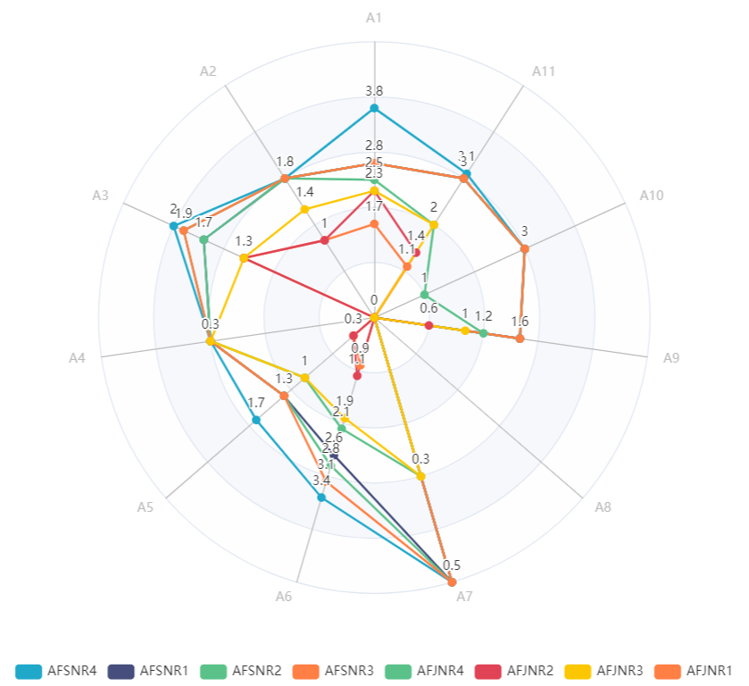
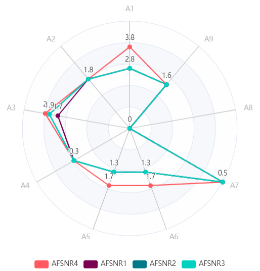

[[_TOC_]]

# Perfil de Competencias

|AF|AF Junior|AF Senior|
|-|-|-|
||||

Las áreas de conocimientos en las que se agrupan las competencias del role son las siguientes:

|Sigla|Área de Conocimiento|
|-|-|
| A1|Requerimientos|
| A2|Diseño Arquitectural|
| A3|Diseño Detallado|
| A4|Construcción|
| A5|Pruebas de Software|
| A6|Gestión de Proyectos|
| A7|Gestión de Configuración|
| A8|Despliegues|
| A9|Gestión de Incidencias|
| A10|Formación|
| A11|Habilidades Blandas|

# Responsabilidades

## Principales Tareas

- Preparar documentos de Alcances por cliente
- Desarrollar y Comunicar el Objetivo del Producto
- Priorizar el Backlog del Producto.
- Maximizar el Valor de cada entrega prevista del producto (Incremento/Release)
- Asegurar el Retorno de la Inversión en cada proyecto
- Representar al cliente ante el equipo SCRUM.
- Representar al equipo SCRUM ante el cliente.
- Definir y comunicar el alcance del Backlog del Sprint (Historias de Usuario)
- Asegurar transparencia, visibilidad y entendimiento del backlog del producto
- Asegurar la aceptación del resultado del sprint (incremento / release)

## Principales Productos de Trabajo

- Documento de Alcance
- Estimación del Proyecto
- Product Backlog
- Sprint Backlog
- Acta de Aceptación
- Presentación de Estado del Proyecto

# Soporte Tecnológico

- [Canal de Comunicación Mattermost](https://mattermost.comsatel.com.pe/)
- Gestión de la Configuración de Software - SCM [GitLab OnPremise](https://project.comsatel.com.pe) y [GitLab Cloud](https://www.gitlab.com/)
- [Dashboards de Proyectos](https://superset.dev.comsatel.com.pe/)